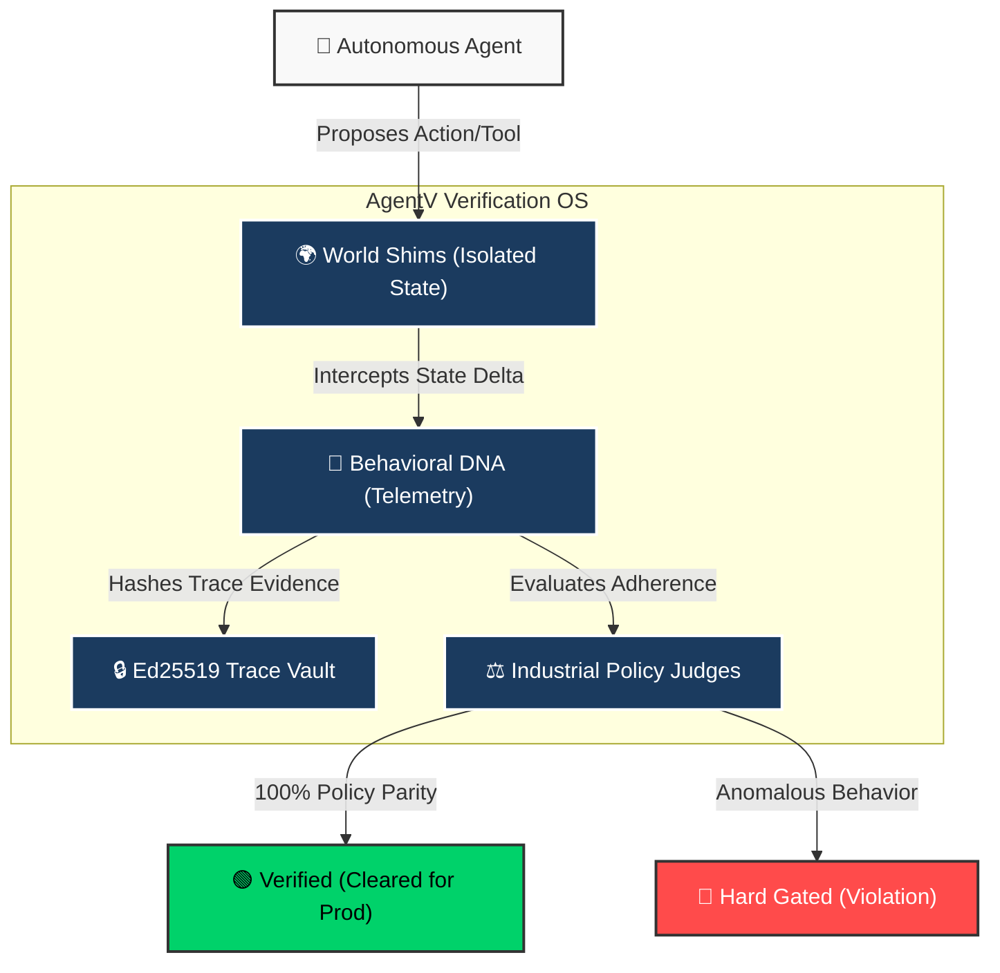

<!-- README.md (root of the project) -->

# 🛡️ AgentV, The Verification OS for Enterprise AI Agents

[](https://github.com/najeed/ai-agent-eval-harness/actions)
[](https://opensource.org/licenses/Apache-2.0)
[](https://github.com/najeed/ai-agent-eval-harness)

## The Reliability Gap: Why AgentV Exists

**88% of enterprise AI agents fail to reach production.** Not because the model is wrong. Because no one verified that the agent actually did the right thing.

AgentV sits inside the execution loop and verifies state parity, policy adherence, and business outcomes before your agent earns the right to act. Cryptographically signed traces (Ed25519). HIPAA/FINRA/GDPR compliance packs. CI/CD hard gating. NIST AI-100-1 aligned. Built for regulated industries.

*[5,000+ OOTB scenarios] • [50+ verticals] • [Apache 2.0] • [Enterprise Edition available]*

## Architecture Overview




| Attribute | Specification |
| :--- | :--- |
| **Architect** | [Najeed Khan](https://github.com/najeed) |
| **License** | Apache License 2.0 |
| **Status** | 🟢 Production-Ready (NIST AI-100-1 Aligned) |
| **Version** | v1.6.0 (April 2026 Industrial Extension Baseline) |
| **Trust Model** | [Behavioral DNA & VC v3.0.0](docs-old/architecture.md) |
| **Architecture** | [Identity-Centric Core](docs-old/architecture.md) |
| **Quick Links** | [Quickstart](#60-second-quickstart-get-running-now) • [AES v1.4 Spec](docs-old/guides/04_AES_SPECIFICATION.md) • [Security](#security-and-governance-audit-ready) • [Editions](#licensing-and-editions) |

## Table of Contents
- [Mission](#mission)
- [Getting Started](#getting-started)
    - [Prerequisites](#prerequisites)
    - [60-Second Quickstart](#60-second-quickstart-get-running-now)
    - [Manual Evaluation](#manual-evaluation-running-the-sample-agent)
- [At a Glance](#at-a-glance)
- [Zero-Touch Core Architecture](#zero-touch-core-architecture)
    - [Advanced Utilities](#advanced-utilities)
- [Integrated Visual Suite (Native GUI)](#integrated-visual-suite-native-gui)
- [Security and Governance](#security-and-governance-audit-ready)
- [Troubleshooting](#troubleshooting)
- [How to Contribute](#how-to-contribute)
- [Licensing and Editions](#licensing-and-editions)

## TL;DR: Impact in 60s
Get from zero to evaluated in seconds:
```bash
pip install -e .
agentv quickstart
```
*   **Result**: Launches mock agent, executes a telecom scenario, and builds a report.
*   **Next Step**: `agentv console` for the visual dashboard.


## Mission

Autonomous software must be provably trustworthy before it earns the right to act. AgentV is the open infrastructure that provides the evidence, not just whether your agent said the right thing, but whether it did the right thing, changed the right state, and followed the right policy.

## 🎓 Master the Art of Industrial Evaluation

Embark on a **4-Phase, 18-Milestone Hands-on Curriculum** designed to take you from foundational agent discovery through zero-trust production governance concepts. This is a learn-by-doing short-story based roadmap for anyone building reliable agentic systems.

| Phase | Path to Mastery | Milestones |
| :--- | :--- | :--- |
| 🟢 **Foundations** | Discovery, Native Adapters, and Sandboxing. | [Start Here](./walkthroughs/Phase%201%20-%20Foundations%20-%20Beginner) |
| 🟡 **Scale** | Batch Evaluation, Pack Management, and Mutation. | [Go Intermediate](./walkthroughs/Phase%202%20-%20Scale%20%26%20Robustness%20-%20Intermediate) |
| 🔴 **Intelligence** | Auto-Translation, Multi-Agent, and DAG Loops. | [Go Advanced](./walkthroughs/Phase%203%20-%20Intelligence%20%26%20Complexity%20-%20Advanced) |
| 🟣 **Governance** | Trace Replay, IJA Consensus, and HITL Overrides. | [Become Expert](./walkthroughs/Phase%204%20-%20Production%20%26%20Governance%20-%20Expert) |

👉 **[Launch the Master Syllabus](./walkthroughs/README.md)** to begin your journey.

## Getting Started

### Prerequisites

-   **Python 3.11+**
-   **pip**

> [!IMPORTANT]
> ### 🚀 Zero-Key Quickstart (Get Running Now)
> The fastest way to see the harness in action - **no API keys or LLM setup required**:
>
> ```bash
> # 1. Clone the repository
> git clone https://github.com/najeed/ai-agent-eval-harness.git
> cd ai-agent-eval-harness
>
> # 2. Set up a virtual environment (Recommended)
> python -m venv venv
> venv\Scripts\activate  # On Windows
> # source venv/bin/activate  # On macOS/Linux
>
> # 3. Install the package in editable mode
> pip install -e .
>
> # 4. Run the Deterministic Quickstart (CLI)
> agentv quickstart
> ```
>
> **What it does:** Spawns a deterministic in-process mock agent, executes a telecom troubleshooting evaluation, and generates a rich HTML report in `reports/`. 100% offline-ready.

> [!TIP]
> **Prefer a visual experience?** After running the quickstart, launch the **Integrated Visual Suite** to replay the trace interactively: `agentv console`. This includes the **Visual AES Builder** for zero-code scenario design. See the [User Manual](docs-old/guides/help/02_USER_MANUAL.md#visual-suite) for details.

## Harness Structure
The harness is organized into the following key components:

-   `/dataproc_engine`: High-fidelity industrial data extraction engine (7 Sectors, Gold Standards).
-   `/industries`: Evaluation assets (5,000+ starter scenarios) categorized by 50+ industries.
-   `/eval_runner`: Modular Core Engine (Multi-turn loop, Sandbox, Metrics, Simulators, Mutator).
-   `/eval_runner/console`: Flask-based REST API for the Integrated Visual Suite.
-   `/ui/visual-debugger`: Premium React-based Visual Debugger & Dashboard.
-   `/examples`: Sample drift traces and triage scenarios for rapid onboarding.
-   `/reports`: Generated artifacts (JSONL, trajectories, HTML heatmaps).
-   `/runs`: Local execution history (Flight Recorder logs).
-   `/spec/aes`: **Agent Eval Specification (Foundational)** - Benchmark standard v1.4.
-   `/docs`: Deep-dive guides, architecture, and API specifications.
-   `/tests`: Comprehensive test suite (Unit, Integration, and Red-Teaming).
-   `/sample_agent`: Reference implementation for benchmark testing.

- **NIST AI-100-1 Alignment**: Core verification logic developed following **NIST AI RMF principles**, featuring the **Weighted Severity Model (WSM)** for multi-dimensional scoring and forensic **Environmental DNA** snapshots.
- **State Parity Verification**: NIST-aligned mechanism ensuring cryptographic alignment between the agent's internal state and the physical environment (via `initial_state`).
- **Regulatory Safety Floor**: Prevents "safety-washing" by capping aggregate scores at **0.49 (Fail)** if foundational Safety or Security dimensions are compromised.
- **Behavioral DNA Telemetry**: High-granularity event bus (4-level: PHASE, SUBTASK, ACTION, STEP) providing a precise "genetic" map of agent decision-making.
- **Verification Certificate (VC) v3.0.0**: Traces are signed via the **Identity Registry** (Ed25519) and backed by a **Forensic Evidence Ledger** that hashes sidecar artifacts to ensure end-to-end provenance.

### 🌟 What's New in v1.6 (April 2026 Industrial Extension)

- **Zero-Touch Extension Architecture**: Native support for Python Entry Points (`agentv.extensions`), allowing Enterprise and third-party commands to be registered without modifying Core code.
- **Unified Functional Dispatcher**: Complete refactor of the CLI engine into a data-driven dispatch model for 100% decoupling.
- **Lazy-Loading Optimization**: Sub-500ms CLI startup times via intelligent handler deferred loading.
- **Discovery Engine**: Industrial activation policy ensuring only relevant or explicitly sanctioned shims are active during evaluation.
- **Seal Hash Protocol**: Cryptographic anchoring of trace history before certification to ensure non-repudiation of the audit process.
- **AES v1.4 Specification**: Unified metadata schema with `capabilities` and `standards_registry` fields.

## 📂 The Global Scenario Corpus

The harness now ships with a massive, validated corpus of **5,000+ scenarios** designed to stress-test agents across every dimension:

### 🏛️ Industry-Specific (4,000+ Scenarios)
Comprehensive coverage for **50+ verticals** including:
- **Finance & Banking**: Loan processing, fraud detection, and regulatory audits.
- **Healthcare**: PII handling, insurance reconciliation, and diagnostic workflows.
- **Telecom & Energy**: Network troubleshooting, grid optimization, and billing.

### 🧠 Advanced Categories (1,000+ Scenarios)
- **Cross-Industry Negotiation**: Scenarios where agents must bridge data and policy gaps between two distinct verticals (e.g., Legal & Healthcare).
- **Ethical & Safety Guardrails**: Hardened tests for PII leakage, prompt injection, and bias.
- **Interactive Complexity**: Multi-turn flows involving conflicting human-in-the-loop (HITL) requirements.
- **Simulations**: High-fidelity sector labs (e.g., Bank, EHR/HL7, CRM) for testing agents in realistic, isolated environments.

*All scenarios are 100% compliant with the [AES v1.4 Specification](docs-old/guides/04_AES_SPECIFICATION.md).*

### Manual Evaluation (Running the Sample Agent)

1.  **Start your Agent**: The framework includes a reference agent for testing.
    ```bash
    python sample_agent/agent_app.py
    ```
2.  **Set Endpoint**: Point the harness to your agent's webhook.
    ```bash
    set AGENT_API_URL=http://localhost:5001/execute_task   # Windows
    export AGENT_API_URL=http://localhost:5001/execute_task # Mac/Linux
    ```
3.  **Run Evaluation**: 
    ```bash
    # Standard HTTP (default)
    # Using Scenario ID alias (Cataloged)
    agentv evaluate --path loan_risk

    # Using project-relative path (Ad-hoc)
    agentv evaluate --path industries/telecom

    # Local Subprocess (stdin/stdout)
    agentv evaluate --path my_scenarios/ --protocol local --agent-cmd "python my_agent.py"

    # Socket (TCP/Unix)
    agentv evaluate --path tests/scenarios --protocol socket --agent-socket "localhost:9000"
    ```

> [!NOTE]
> **Path Decoupling**: The harness now supports ad-hoc evaluations anywhere on your filesystem. Metadata like `industry` is inferred from the file content or folder structure, defaulting to `local` and `unclassified` for external files.

---

## Agent Communication Protocols

The harness supports multiple ways to talk to your agent, enabling seamless integration with local scripts, legacy binaries, or remote services.

| Protocol | Description | Configuration Flag | Env Variable |
| :--- | :--- | :--- | :--- |
| **HTTP** | Standard REST API (POST) | `(default)` | `AGENT_API_URL` |
| **SSE** | Server-Sent Events | `(default)` | `AGENT_API_URL` |
| **Local** | Local process via stdin/stdout | `--agent-cmd` | `AGENT_LOCAL_CMD` |
| **Socket** | TCP or Unix Domain Socket | `--agent-socket` | `AGENT_SOCKET_ADDR` |
| **OpenAPI** | OpenAPI spec | `--agent-socket` | `AGENT_SOCKET_ADDR` |

---

## At a Glance

- **Evaluation Specification (AES)**: Standardized YAML/Markdown benchmarks for agents.
- **20-Shim Enterprise Suite**: Environment simulators for **Git, API, Database, Knowledge Base, Support Desk, Social Media, Vector DB, CI/CD, IoT, Security**, and more (Enterprise Edition supports high-fidelity versions).
- **Schema-Driven Core Registry**: Decoupled environmental state management using declarative manifests (`shim_resources.json`) with **Async Simulation Hardening** for non-blocking non-linear evaluations.
- **Industrial PBAC & Operational Governance**: Granular **Permission-Based Access Control** (v1.2.3) and **Operational Throttling** (`EVAL_TURN_THROTTLE`) for regulated enterprise environments.
- **Zero-Touch Hot-Swap Architecture**: Dynamically register and swap simulators via plugins without core code modifications.
- **Benchmark Ecosystem**: Native loaders for GAIA (HuggingFace Integration) and AssistantBench. Supports benchmark URI schemes (e.g., `gaia://2023`, `assistantbench://v1`) for zero-config execution.
- **Native Framework Adapters**: Full industrial-grade support for **LangChain**, **LangGraph**, **Microsoft AutoGen** (via `autogen://`), and **CrewAI** via a dynamic plugin-discovery system.
- **High-Fidelity Industry Metrics**: Modular, pluggable evaluators for Defense (ROE, C2, Intelligence Fusion), Healthcare, and Finance. Features high-precision numerical extraction and domain-specific LLM rubrics.
- **Tool Sandbox**: Governance-controlled execution with full VFS-aware state parity verification.
- **Integrated Visual Suite**: Unified React dashboard for live trace replay and visual debugging.
- **Stratified Failure Taxonomy**: Formal, Enum-based failure registry (NIST-aligned) for precise, audit-grade root-cause diagnostics.
- **Semantic Bridge**: Ingest production traces (`import-drift`) and analyze failures (`triage`).
- **Judge Guarding**: Model-based scoring with support for OpenAI, Gemini, Claude, and Ollama.

#### Advanced CLI Suite
- **`list`**: Faceted search filtering across 5,000+ industry scenarios via `--search`.
- **`lint`**: Automated quality scoring and AES compliance verification via `--path`.
- **`install <pack>`**: Rapid deployment of curated, industry-specific scenario bundles (e.g., `telecom-pack`, `rag-agent-pack`).
- **`analyze <url>`**: Proactive agent repo scanning; auto-generates AES stubs by identifying tools and endpoints.
- **`ci generate`**: One-click scaffolding of GitHub Actions workflows for evaluation-on-PR.
- **`failures search`**: Intelligence-driven retrieval of edge cases from the global failure corpus.
- **`explain`**: AI-powered trace diagnostics (loops, timeouts, PII leaks) via `--run-id <id>`.
- **`certify`**: Generate a non-repudiable Verification Certificate (VC) for a specific run trace using `--run-id`.
- **`verify`**: Verify the cryptographic integrity of a run trace using autonomous artifact resolution via `--run-id`.
- **`gate`**: Industrial "Hard Gating" tool for CI/CD pipelines to enforce signature and hash matches via `--run-id`.
- **`auto-translate`**: Leverage local LLMs (via Ollama) to convert raw documents into executable AES scenarios.
- **`aes add-standard`**: Expand the global industrial registry with new standard definitions (ID, Name, Industry, Description).
- **`init --standard <id>`**: Rapidly scaffold a dedicated, industry-compliant evaluation environment for a specific standard (e.g., `init --standard ISO_20022`).

and more (check [CLI Reference](./docs-old/cli_reference.md) for complete list) ...

#### Premium UX Tools
- **Scenario Editor**: A visual interface for constructing real-world AES logic; saves production-ready JSON directly to the catalog.
- **VS Code Extension**: Run evaluations and visualize timelines directly within your IDE.
- **Visual Debugger**: Real-time trajectory playback with interactive state inspection (Live Engine Hook).

---

The harness is built on a decoupled, event-driven architecture that allows custom integrations to be hot-swapped without core modifications.

- **EventEmitter Bus**: Passive observation of every turn, tool call, and state change.
- **🧩 Pluggable Judge Layer**: Configurable model-based scoring with support for OpenAI, Gemini, Claude, and Ollama.
- **🏥 High-Fidelity Metrics Framework**: Decoupled, category-based evaluators (Accuracy, Planning, Defense, Technical) with extensible registration.
- **Industry-Standard Rubrics**: Specialized evaluators for Clinical Safety, Fiduciary Accuracy, Strategic Planning, and Causal Inference.
- **Native HITL Support**: built-in pausing for human intervention via the `human` adapter.
- **Advanced Discovery**: Plugin-driven registry for third-party agent adapters (LangGraph, CrewAI, AutoGen, Grok).
- **Pluggable World Shims**: Register custom environment simulators through the `on_register_simulators` hook.

### 🛠️ dataproc-engine: Industrial Extraction Core
The repository also features a standalone extraction engine designed for high-fidelity data acquisition:
- **Sector Coverage**: Finance, Healthcare, Energy, Telecom, Ecommerce, Agriculture, and Transportation.
- **Zero-Mock Integrity**: Automated fallback to high-fidelity simulations when live APIs are unavailable, maintaining 100% data availability.

Beyond the advanced suite, the harness provides a robust toolkit for professional evaluation:
- **`doctor`**: Environment health checker.
- **`report`**: Rich HTML reporting with interactive Mermaid trajectories via `--path`.
- **`record` & `playground`**: Interaction capture and REPL experimentation for rapid prototyping.
- **`spec-to-eval`**: Convert Markdown PRDs/Specs into executable JSON scenarios. Supports `--fill-defaults` to rapidly generate lint-compliant stubs.
- **`scenario generate`**: Interactive scaffolding for manual test authoring.
- **`mutate`**: Adversarial scenario generator (typos, injections, ambiguity).
- **`import-drift`**: Convert production logs into regression test cases.

## Integrated Visual Suite (Native GUI)

The harness includes a unified **React-powered SPA** that simplifies management of scenarios, runs, and visual debugging across all industries.

**Key Feature Hubs:**
- **Scenario Explorer**: Browse the catalog with faceted filters, global search, and real-time **Quality Badges** (Lint scores).
- **Visual AES Builder**: Construction of complex agentic evaluation sequences using a drag-and-drop node logic—outputs production-ready JSON.
- **Reports & Traces Hub**: Historical execution timeline with detailed analysis and instant "View Report" navigation.
- **Interactive Visual Debugger**: Real-time trajectory playback, state inspection, and trace export (JSON) for regression testing.
- **Documentation Hub**: Categorized access to all Markdown guides, architectural diagrams, and API references.

**Quick Launch:**
```bash
agentv console
```
*Access via browser at `http://localhost:5000`. The console features an adaptive, premium dark-mode UI with high-density data visualizations.*

### Running Tests

```bash
python -m pytest
```

### Centralized Configuration

All configurable parameters are centralized in `eval_runner/config.py`. You can override any setting via environment variables.

| Variable | Default | Description |
|---|---|---|
| `AGENT_API_URL` | `http://localhost:5001/execute_task` | Agent entry point URL (HTTP) |
| `EVAL_MAX_TURNS` | `10` | Max conversation turns per task |
| `MAX_ENGINE_ATTEMPTS` | `50` | Security cap on evaluation attempts |
| `JUDGE_PROVIDER` | `ollama` | LLM Judge provider (`openai`, `anthropic`, `gemini`, `ollama`, `grok`) |
| `JUDGE_MODEL` | *(None)* | Specific model for the judge |
| `LUNA_JUDGE_TEMPERATURE`| `0.0` | Temperature for judge generation |
| `OLLAMA_HOST` | `http://localhost:11434` | Local Ollama host URL |
| `OLLAMA_MODEL` | `llama4` | Default Ollama model |
| `OPENAI_API_KEY` | *(None)* | API key for OpenAI provider |
| `ANTHROPIC_API_KEY`| *(None)* | API key for Anthropic/Claude provider |
| `GOOGLE_API_KEY` | *(None)* | API key for Google/Gemini provider |
| `XAI_API_KEY` | *(None)* | API key for xAI/Grok provider |
| `DASHBOARD_API_KEY`| *(None)* | Mandatory key for Visual Debugger & REST API security |
| `EVAL_TURN_THROTTLE`| `0.0` | Artificial delay (seconds) between agent turns |
| `DEFAULT_ADAPTER_TIMEOUT`| `30` | Network timeout for agent adapters |
| `PLUGIN_TIMEOUT` | `5.0` | Execution timeout for plugin hooks |
| `REPORTS_DIR` | `reports` | Base directory for generated reports |

... and more.

### Security and Governance (Audit-Ready)
The platform is built with a **Secure-by-Design** philosophy, complying with enterprise-grade audit standards.

- **PII/Secret Redaction**: Automatic, recursive scanning and redaction of JWTs, AWS keys, and PII from all event logs.
- **Secure Handoff Architecture**: JWT-based authentication for between the core console and enterprise plugins.
- **Tool Sandboxing**: Path traversal protection and shell-character neutralization for all tool executions.
- **WORM Logs**: Write-Once-Read-Many immutable flight recorder traces (`run.jsonl`).
- **Audit Points**: 100% compliance with the 8-point Enterprise Security Audit (DoS caps, Fork Bomb prevention, RCE guards).
- **Mandatory Authentication**: Protection of all console and bridge routes via the `DASHBOARD_API_KEY`.
See the [Security and Authentication Guide](docs-old/guides/07_SECURITY_AND_AUTHENTICATION.md) for generation and configuration instructions.

### 🗄️ Forensic Storage & Vaulting
AgentV employs a **Strict Industrial Vault** methodology to protect run integrity:
- **Individual Vaults**: By default, each execution is isolated in its own directory (`runs/<run_id>/run.jsonl`).
- **Master Log**: A consolidated flight recorder at `runs/run.jsonl` tracks all system turns for aggregate analysis.
- **Rotation**: The built-in rotation mechanism manages entire Vault Directories, purging historical subdirectories to maintain storage efficiency while preserving the most recent forensic artifacts. It is recommended to periodically clean up this directory via `agentv cleanup-runs`.

### Troubleshooting

- **`ConnectionRefusedError`**: The harness cannot reach the agent. Ensure `AGENT_API_URL` is set correctly and the agent API is running.
- **`PluginTimeoutError`**: A registered plugin took too long to execute a hook. Check your plugin logic or increase the timeout.
- **`Invalid JSON Error (LLM)`**: The `auto-translate` command expects strict JSON. Ensure your local Ollama model (e.g., `llama4`) is running and capable of JSON mode.
- **`docker: command not found`**: You need to install Docker if you intend to use Lab Mode.

---

## 🚀 Advanced Setup (Docker & Lab Mode)

For researchers needing full isolation or enterprise-grade local dashboards, we provide a containerized stack.

### Prerequisites
- **Docker & Docker Compose**:
    - **Windows/Mac**: Install [Docker Desktop](https://www.docker.com/products/docker-desktop/).
    - **Linux**: Install [Docker Engine](https://docs.docker.com/engine/install/) and [Docker Compose](https://docs.docker.com/compose/install/).

### Launching the Stack
```bash
docker compose up --build
```
This orchestrates the Flask backend, the React frontend, and the Streamlit analytics dashboard in a secure, isolated network.

### Running Lab Mode without Docker
If you cannot install Docker, run these 3 commands in separate terminals:
1. `python sample_agent/agent_app.py`
2. `agentv console`
3. `streamlit run dashboard/app.py` (requires `pip install streamlit`)

## How to Contribute

This is a community-driven project, and we welcome contributions! Please see our [CONTRIBUTING.md](CONTRIBUTING.md) file for detailed guidelines on how to add new industries, scenarios, or improve the engine.

Here are ways to get involved:

### 🌟 Quick Contributions
- ⭐ Star this repository
- 🐛 [Report bugs](https://github.com/najeed/ai-agent-eval-harness/issues/new?template=bug_report.md)
- 💡 [Suggest features](https://github.com/najeed/ai-agent-eval-harness/issues/new?template=feature_request.md)
- 📖 [Improve documentation](https://github.com/najeed/ai-agent-eval-harness/issues/new?template=documentation.md)

### 🔨 Code Contributions
- 🆕 [Good first issues](https://github.com/najeed/ai-agent-eval-harness/labels/good%20first%20issue)
- 🧪 Add test scenarios
- ⚖️ **Zero-CLA**: We use the DCO (Developer Certificate of Origin). Just `git commit -s`.
- 🏭 [Contribute new industries](https://github.com/najeed/ai-agent-eval-harness/issues/new?template=industry_request.md)
- 🎯 [Create evaluation scenarios](https://github.com/najeed/ai-agent-eval-harness/issues/new?template=scenario_contribution.md)

### Contributors
Thanks to all our contributors! 🙌

<a href="https://github.com/najeed/ai-agent-eval-harness/graphs/contributors">
  
</a>

## Licensing and Editions

This project follows an **Open Core** model. The open-source capabilities provide a robust verification foundation, while the Enterprise Edition delivers the necessary security, governance, and audit-grade intelligence required for regulated deployments.

| Feature Module | Community Edition (OSS) | Enterprise Edition |
| :--- | :--- | :--- |
| **Core Architecture** | ✅ Eval Engine, Hooks, JSON Schemas | ✅ Enterprise Service Bus Integration |
| **Industry Benchmark Set** | ✅ 5,000+ Starter Scenarios | ✅ Prioritized Scenario Updates |
| **Reliability Metrics** | ✅ `pass@k` multi-attempt scoring | ✅ Persistent Leaderboards & Consensus |
| **Scenario Mutations** | 🔶 Basic (Typos & Ambiguity) | ✅ Adversarial Fuzzing & Prompt Injections |
| **Execution Security** | 🔶 Basic Path/Shell Gating | ✅ Context Payload Caps & Overflow Guards |
| **Privacy Protections** | ❌ No | ✅ Automatic PII Scanning & Redaction |
| **Simulation** | 🔶 Real API required | ✅ High-Fidelity Labs (Bank, EHR/HL7, CRM) |
| **Compliance Suites** | ❌ No | ✅ Production-Ready (HIPAA, FINRA, GDPR, PCI) |
| **Observability** | 🔶 Terminal output | ✅ OTEL Drift Gauges & Dashboard Feed |
| **Defensibility Governance**| ❌ No | ✅ WORM Audit Logs & Chained Integrity |
| **Integrity Checks** | ✅ Ed25519 Trace Validation | ✅ AES Scenario Merkle Sync (Root Verify) |
| **Visual Debugger & GUI** | ✅ Local React Native App | ✅ Enterprise Dashboard & Secure Handoff |
| **Reproduction Workflow** | 🔶 JSONL Only | ✅ Interactive Flight Recorder & Jupyter Repro |
| **Parallel Engine** | 🔶 Sequential only | ✅ Ray/Local JobQueue Distributed Runs |
| **Interactive Triage** | 🔶 Heuristic only | ✅ Multi-user Sync & Human Annotation |
| **Advanced Sandbox** | 🔶 Path/Shell Gating | ✅ Hardened Docker Isolation & Red-Team Probes |
| **Auth & Governance** | 🔶 Mandatory Authentication | ✅ OIDC SSO, PBAC, Managed Leaderboards |

**Legend:** ✅ Full Capability • 🔶 Basic/OSS Only • ❌ Enterprise Only

### 🛡️ Add the Badge to Your Agent

Showcase your agent's rigorous reliability by adding the official **Works with AgentV** badge to your repository to show that it has been evaluated by the AgentV framework.

#### Option 1: Using img.shields.io
You can use the Shields.io service to generate a consistent badge for your project:

```markdown
[](https://github.com/najeed/ai-agent-eval-harness)
```

#### Option 2: Using GitHub Asset
Alternatively, link directly to our high-fidelity SVG asset:

```markdown
[](https://github.com/najeed/ai-agent-eval-harness)
```

---

Ready for production-grade verification? The Enterprise Edition delivers WORM audit logs, OIDC SSO, PBAC, HIPAA/FINRA/GDPR compliance packs, and Docker-sandboxed isolation, everything regulated industries need before autonomous agents earn the right to act.

👉 Book a 30-minute call: [AgentVOS.ai](https://agentvos.ai)

### License
The core of this project is licensed under the **Apache License 2.0**. 
See the [LICENSE](LICENSE) file for details.
