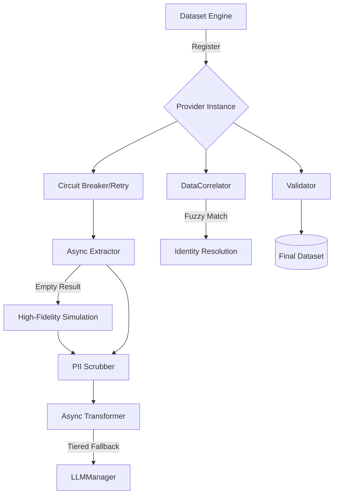

# Generic ETL Framework Architecture

## Overview
The ETL framework is designed to be modular, extensible, and robust. It uses a **Provider Pattern** to abstract industry-specific data source logic from the core processing engine.

## Core Components

### 1. Dataset Engine (Orchestrator)
The central controller that:
*   Loads industry configurations from a **Unified 16-Sector Registry**.
*   Instantiates the appropriate `Provider` lifecycle.
*   Handles parallel execution and resource management (e.g., rate limiting).

### 2. Provider Lifecycle
Each industry pilot implements a `Provider` that follows a standardized 4-stage lifecycle:

1.  **Extract**: Fetches raw data from external APIs or files. Supports PDF/Web/REST.
2.  **Simulate (Fallback)**: When source data is unavailable, generates high-fidelity, industry-aware mock artifacts using the `BaseProvider` simulation factory.
3.  **Transform (Async)**: Maps raw data into `StandardSchema` using Tiered LLM extraction (Cloud -> Local -> Heuristic).
4.  **Validate**: Performs integrity checks and domain-specific consistency verification.
5.  **Correlate**: Establishes cross-industry links and enriches records with fuzzy-matched identity resolution.

## Deep Hardening Layers

### 🛡️ 1. Resiliency & Fault Tolerance
The `BaseProvider` implements a mission-critical resiliency layer:
*   **Circuit Breaker**: Detects repeated failures (e.g., API 500s or 429s) and trips to prevent cascading exhaustion of resources.
*   **Exponential Backoff**: Automatic retries with randomized jitter to handle transient network instability gracefully.

### 🔐 2. Security Layer
To ensure enterprise-grade compliance during industrial signal extraction:
*   **Autonomous PII Scrubbing**: A regex-based engine in the `BaseProvider` cleans emails, phone numbers, and sensitive identifiers from raw unstructured text *before* it reaches the LLM inference tier.
*   **Immutable Checksums**: All records are now secured with a SHA-256 hash of their content, ensuring data-aware integrity throughout the pipeline.

## Data Flow Diagram

## Extensibility Pattern
To add a new industry (e.g., "Healthcare"):
1.  Implement `HealthcareProvider` (overriding `extract()` and `transform()`).
2.  Register the provider in `dataproc_engine/cli/main.py`.
3.  The `DatasetEngine` and `DataCorrelator` automatically handle the orchestration and cross-vertical matching.
