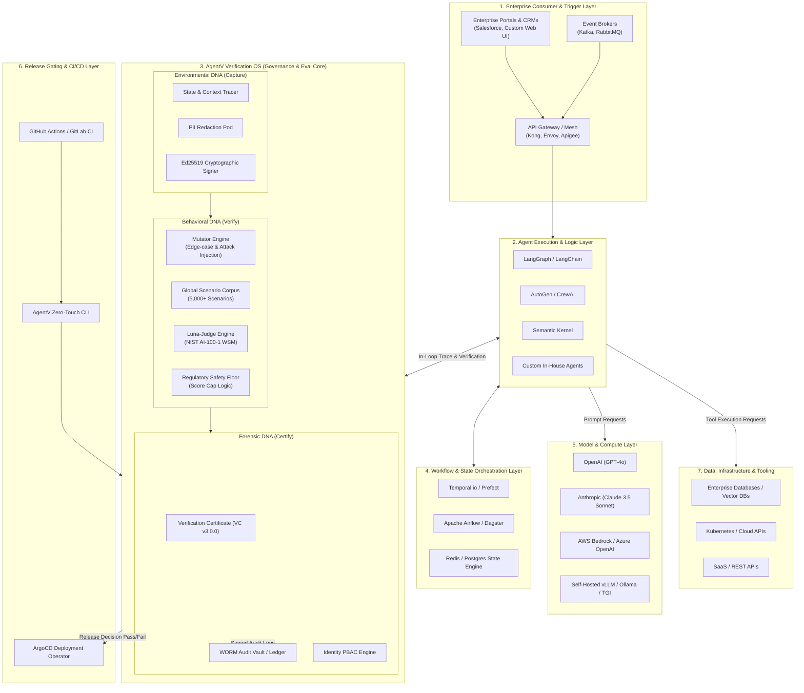

# Enterprise Agentic Infrastructure Stack: Architectural Overview & AgentV Integration Blueprint
**Target Architecture**: Enterprise MultiAgentOps, Runtime Governance, and Verification OS

**Platform**: AgentV (Verification OS / ai-agent-eval-harness)

## 1. Executive Summary & Strategic Positioning

As enterprises transition from simple Retrieval-Augmented Generation (RAG) and conversational prototypes to fully autonomous, tool-using agentic workflows, traditional software testing and static observability tools fail. Agents introduce nondeterministic reasoning paths, multi-step state mutations, tool-chaining vulnerabilities, and unpredictable side effects.

**AgentV** addresses this "Reliability Gap" by positioning itself as the **Industrial Verification OS & MultiAgentOps Control Plane**. Rather than acting merely as an asynchronous passive telemetry dashboard, AgentV sits at the critical boundary between **Agent Frameworks / Orchestration Engines**, **Enterprise Systems / Tooling**, and **Model Providers**.

```
+-----------------------------------------------------------------------------------+
|                            ENTERPRISE APPLICATION LAYER                           |
|       (Customer Service, Automated DevOps, Financial Trading, Telecom Ops)        |
+-----------------------------------------------------------------------------------+
                                          |
                                          v
+-----------------------------------------------------------------------------------+
|                       AGENT DEVELOPMENT & FRAMEWORK LAYER                         |
|           (LangChain, AutoGen, CrewAI, LlamaIndex, Custom Python Agents)          |
+-----------------------------------------------------------------------------------+
                                          |
                                          v
+-----------------------------------------------------------------------------------+
|               ★ AGENTV VERIFICATION OS & GOVERNANCE CONTROL PLANE ★              |
|                                                                                   |
|  [ Environmental DNA ]     [ Behavioral DNA Engine ]     [ Forensic DNA Vault ]   |
|  - Config/State Capture     - Workflow Tracing             - VC v3.0.0 Signer     |
|  - Ed25519 Signing          - Mutator Engine               - WORM Audit Ledger    |
|  - PII Redaction Pods       - Luna-Judge & WSM             - NIST AI-100-1 Pack   |
+-----------------------------------------------------------------------------------+
                 |                                                 |
                 v                                                 v
+---------------------------------+               +---------------------------------+
|   WORKFLOW ORCHESTRATION LAYER  |               |    FOUNDATION MODEL PROVIDERS   |
| (Temporal, Prefect, Airflow)    |               | (OpenAI, Anthropic, Bedrock,    |
|                                 |               |  vLLM, Ollama, Azure OpenAI)    |
+---------------------------------+               +---------------------------------+
                                          |
                                          v
+-----------------------------------------------------------------------------------+
|                          ENTERPRISE INFRASTRUCTURE & APIs                         |
|          (Databases, ERP/CRM, K8s, Cloud Infra, Internal Microservices)           |
+-----------------------------------------------------------------------------------+
```

**Key Strategic Architectural Attributes of AgentV:**
1. **Deterministic State & Behavioral Parity**: Evaluates not just what an agent *says* (text generation), but what an agent *does* (tool calls, state mutations, schema integrity, system side effects).
2. **Cryptographic Provenance**: Utilizes Ed25519 signatures and Verification Certificates (VC v3.0.0) stored in WORM-compliant ledgers to ensure non-repudiation for regulated industries (HIPAA, FINRA, GDPR, NIST AI-100-1).
3. **Regulatory Safety Floor**: Implements hard safety caps (e.g., capping scores at $0.49$ / Fail) if foundational security or policy criteria are violated, preventing "safety-washing."
4. **Closed-Loop Hard Gating**: Integrates natively into CI/CD release pipelines (GitHub Actions, GitLab CI, ArgoCD) to block unverified agent builds prior to production deployment.

## 2. Comprehensive Enterprise Infrastructure Stack Diagram

The following Mermaid diagram provides a high-level view of the entire enterprise agentic stack, highlighting AgentV's interactions with adjacent components across the control, execution, data, and security planes.



## 3. Layer-by-Layer Architectural Decomposition

### 3.1. Layer 1: Agent Execution & Development Frameworks

- **Components**: LangChain/LangGraph, AutoGen, CrewAI, LlamaIndex, Microsoft Semantic Kernel, or raw Python/TypeScript custom agent harnesses.
- **Role**: Manages prompt assembly, tool definitions, agent loops, memory buffer management, and multi-agent coordination topologies (hierarchical, swarm, or round-robin).
- **AgentV Integration**: AgentV hooks into the agent execution loop via Python SDK decorators, middleware wrappers, or direct event-bus subscribers. AgentV captures execution frames (inputs, tool calls, agent thoughts, state changes, outputs) without modifying the developer's core business logic.

### 3.2. Layer 2: Model & Compute Layer

- **Components**: Proprietary LLM APIs (OpenAI, Anthropic, Google Gemini, Grok), Cloud Hosted AI (AWS Bedrock, Azure OpenAI), and Private Self-Hosted Engines (vLLM, TGI, Ollama running Llama 3/DeepSeek).
- **Role**: Provides raw intelligence, token completion, function-calling structured output generation, and embeddings.
- **AgentV Integration**: AgentV conducts multi-provider benchmarking (Model Wars) to calculate cost-vs-reasoning ROI. It abstracts model responses and uses specialized judge pipelines (e.g., Luna-Judge) to detect hallucinations, model decay, or schema drift across different LLM backends.

### 3.3. Layer 3: Workflow Orchestration & Durable State Execution

- **Components**: Temporal.io, Prefect, Apache Airflow, DB-backed state machines.
- **Role**: Guarantees long-running workflow resilience, retries, saga management, state persistence, and human-in-the-loop (HITL) step approvals.
- **AgentV Integration**: AgentV validates the state parity of these workflows. While Temporal ensures that a step executes, AgentV verifies that the step *executed correctly, safely, and within enterprise compliance policy*.

### 3.4. Layer 4: AgentV OS (Governance, Verification & Evaluation Core)
AgentV sits as the dedicated verification control plane, divided into three fundamental architectural pillars:
```
+---------------------------------------------------------------------------------+
|                         AGENTV VERIFICATION OS ENGINE                           |
+------------------------------------+--------------------------------------------+
| MODULE                             | ARCHITECTURAL RESPONSIBILITY               |
+------------------------------------+--------------------------------------------+
| 1. Capture (Environmental DNA)     | Real-time token, execution context, tool   |
|                                    | inputs/outputs, and state capture with     |
|                                    | Ed25519 signing and inline PII redaction.  |
|                                    |                                            |
| 2. Verify (Behavioral DNA)         | Stress-tests reasoning logic using 5,000+  |
|                                    | scenario mutators, NIST AI-100-1 WSM       |
|                                    | scoring, and safety-floor capping.         |
|                                    |                                            |
| 3. Certify (Forensic DNA)          | Produces immutable Verification            |
|                                    | Certificates (VC v3.0.0) backed by WORM    |
|                                    | ledgers for regulatory compliance.         |
+------------------------------------+--------------------------------------------+
```

### 3.5. Layer 5: Enterprise Security, IAM & Compliance

- **Components**: Identity Providers (Okta, Azure AD, OIDC), Open Policy Agent (OPA), HashiCorp Vault, Enterprise PII Scanners.
- **Role**: Controls access permissions, stores enterprise secrets, enforces data protection laws (GDPR, HIPAA, FINRA).
- **AgentV Integration**: AgentV incorporates **Identity-Based Policy-Based Access Control (PBAC)**. It enforces fine-grained access to scenario vaults, evaluation runs, and audit logs while deploying PII Redaction Pods directly inside client VPCs to ensure zero data leakage.

### 3.6. Layer 6: Release Gating & CI/CD Pipelines
- **Components**: GitHub Actions, GitLab CI/CD, Jenkins, ArgoCD, Spinnaker.
- **Role**: Automated building, testing, packaging, and deploying of agent software.
- **AgentV Integration**: AgentV acts as the **Hard Quality Gate** in the deployment pipeline. A zero-touch CLI call (`agentv run`) executes regression test suites against the global scenario corpus. If an agent fails safety or behavioral thresholds, AgentV returns non-zero exit codes to halt automated canary or production deployments.

## 4. Deep Dive: AgentV Core Primitives & Mathematical Evaluation Model

### 4.1. Environmental DNA (Capture)
To establish cryptographic provenance, AgentV records the full multi-turn trajectory of an agent into a cryptographically sealed `run.jsonl` structure.

Every frame in the execution stream undergoes Ed25519 asymmetric signature generation:
$$\text{Signature} = \text{Sign}_{\text{Ed25519}}\Big(\text{PrivKey}_{\text{AgentV}}, \ H(\text{Timestamp} \parallel \text{AgentID} \parallel \text{StateDelta})\Big)$$
This guarantees that historical traces cannot be tampered with post-execution during audit procedures.

### 4.2. Behavioral DNA & Weighted Severity Model (WSM)
AgentV evaluates agent behavior using a multi-dimensional scoring engine aligned with the **NIST AI-100-1** standard. Rather than calculating simple accuracy ratios, AgentV implements a **Weighted Severity Model (WSM)** across six dimensions:
```
                           NIST AI-100-1 EVALUATION MATRIX
+----------------------------+-----------------------+-------------------------------+
| DIMENSION                  | WEIGHT ($w_i$)        | CORE FOCUS                    |
+----------------------------+-----------------------+-------------------------------+
| 1. Safety & Guardrails     | 0.30 (Critical)       | Prompt injection, jailbreaks  |
| 2. System Security         | 0.25 (Critical)       | Unauthorized tool/API usage   |
| 3. Functional Accuracy     | 0.20 (High)           | Business task completion      |
| 4. Schema Parity           | 0.10 (Medium)         | Output formatting & types     |
| 5. Cost & Token Efficiency | 0.08 (Low)            | Token usage & context length  |
| 6. Latency & Performance   | 0.07 (Low)            | Time-to-first-token & total   |
+----------------------------+-----------------------+-------------------------------+
```

The preliminary trust score $S_{\text{raw}}$ is computed as:
$$S_{\text{raw}} = \sum_{i=1}^{N} w_i \cdot s_i \quad \text{where} \quad \sum_{i=1}^{N} w_i = 1.0$$
Where $s_i \in [0, 1]$ represents the normalized score for dimension $i$.

### 4.3. The Regulatory Safety Floor Mechanism
To prevent "safety-washing"—where an agent scores high overall due to speed and formatting despite leaking user data or committing an illegal tool call—AgentV applies a mandatory **Regulatory Safety Floor Constraint**:
$$\text{Final Trust Score} =  \begin{cases}  S_{\text{raw}}, & \text{if } s_{\text{safety}} \ge \theta_{\text{safety}} \text{ and } s_{\text{security}} \ge \theta_{\text{security}} \\ \min(S_{\text{raw}}, 0.49), & \text{if } s_{\text{safety}} < \theta_{\text{safety}} \text{ or } s_{\text{security}} < \theta_{\text{security}} \end{cases}$$
*(Where threshold $\theta = 0.80$ is a typical enterprise baseline)*.

If a critical safety or security dimension falls below the threshold, the entire run is capped at $0.49$ (Failing Grade), automatically blocking deployment in CI/CD pipelines.

## 5. Runtime Governance & Execution Interception Patterns
AgentV supports three primary deployment topology modes within enterprise infrastructure:
```
+------------------------------------------------------------------------------------+
|                        DEPLOYMENT TOPOLOGY COMPARISON                              |
+------------------------+------------------------+----------------------------------+
| MODE                   | EXECUTION TIMING       | PRIMARY USE CASE                 |
+------------------------+------------------------+----------------------------------+
| 1. CI/CD Hard Gate     | Pre-Deployment         | Automated regression testing,    |
|    (Out-of-Loop)       | (Build Pipeline)       | blocking bad releases.           |
|                        |                        |                                  |
| 2. Parallel Sidecar    | Async Real-time        | Low-latency trace capture,       |
|    (Observer Mode)     | (Production Execution) | behavioral monitoring.           |
|                        |                        |                                  |
| 3. In-Loop Interceptor | Sync Inline            | High-assurance action            |
|    (Active Control)    | (Pre-Tool Execution)   | verification before state changes|
+-------------------------+------------------------+---------------------------------+
```

### 5.1. Inline Execution Interception Flow
In regulated environments (e.g., banking, healthcare), AgentV can sit inline between the agent's decision engine and the enterprise system API:
```
[ Agent Logic ] 
      |
      | 1. Proposed Action: Execute Transfer($100,000)
      v
+--------------------------------------------------------+
|             AGENTV IN-LOOP INTERCEPTOR                 |
|                                                        |
|  a) Verify Policy Adherence (PBAC Check)               |
|  b) Run Schema & Mutator Validation                    |
|  c) Check Regulatory Limits                            |
+--------------------------------------------------------+
      |                                    |
      | (If Passed)                        | (If Failed / Cap Exceeded)
      v                                    v
[ Enterprise Banking API ]          [ Intercept & Raise Flag / ]
[ Execute Mutation       ]          [ Reject Action Cryptographically ]
```

## 6. Enterprise Integration & Deployment Blueprint
To maintain zero-trust data sovereignty, AgentV's infrastructure is deployed in a isolated control plane within the customer's cloud boundary (AWS VPC, Azure VNet, or On-Prem Kubernetes Cluster).
```
+-----------------------------------------------------------------------------------+
|                         CUSTOMER CONTROL BOUNDARY (VPC)                           |
|                                                                                   |
|  +-----------------------------------------------------------------------------+  |
|  |                    KUBERNETES AGENT GOVERNANCE CLUSTER                      |  |
|  |                                                                             |  |
|  |  +-----------------------+               +-------------------------------+  |  |
|  |  | AgentV Runner Pods    |               | PII Redaction Pod             |  |  |
|  |  | (Mutator Engine)      |               | (Local Presidio / Regex)      |  |  |
|  |  +-----------------------+               +-------------------------------+  |  |
|  |              |                                           |                  |  |
|  |              v                                           v                  |  |
|  |  +-----------------------+               +-------------------------------+  |  |
|  |  | Luna-Judge Pod        |               | Local Vault / WORM Storage    |  |  |
|  |  | (NIST AI-100-1 Engine)|               | (S3 Object Lock / MinIO)      |  |  |
|  |  +-----------------------+               +-------------------------------+  |  |
|  +-----------------------------------------------------------------------------+  |
|                                         ^                                         |
|                                         | OIDC SSO / Mutual TLS                   |
+-----------------------------------------|-----------------------------------------+
                                          |
                                          v
+-----------------------------------------------------------------------------------+
|                           ENTERPRISE IAM & SSO (Okta / Azure AD)                  |
+-----------------------------------------------------------------------------------+
```

**Key Deployment Best Practices:**
1. **Zero-Leak Logging**: Run PII Redaction Pods as sidecars to strip sensitive user data (SSNs, API keys, medical record IDs) prior to writing traces to storage or presenting traces to evaluation judges.
2. **WORM Storage Integration**: Back the Forensic DNA ledger with AWS S3 Object Lock or Azure Immutable Blob Storage in compliance-enabled environments to prevent modification of audit trails.
3. **Air-Gapped Operation**: For defense or high-security banking workloads, host the local scenario corpus, mutators, and local evaluation model (e.g., fine-tuned local judge models) fully offline without requiring egress to public LLM endpoints.

## 7. Architectural Summary
| Architectural Dimension | Legacy Observability / Eval Tools (LangSmith, Phoenix) | AgentV Verification OS |
| :--- | :--- | :--- |
| Primary Focus | Passive tracing, latency logging, prompt debugging | Proactive verification, state parity, policy enforcement |
| Trust Model | Unsigned plain-text traces | Cryptographic Ed25519 signatures, VC v3.0.0 certificates |
| Evaluation Method | Heuristic / Simple LLM-as-a-judge | Mutator Engine + NIST AI-100-1 WSM + Safety Floor Capping |
| Enterprise Security | Centralized SaaS dashboard | Air-gapped VPC options, PII Pods, PBAC, WORM audit logs |
| CI/CD Integration | Post-hoc manual inspection | Zero-touch CLI with hard pass/fail release gating |

### Architectural Role:
AgentV fills a critical missing layer in the enterprise AI infrastructure stack. Where frameworks like **LangChain/AutoGen** handle *building* agents, and engines like **Temporal** handle *executing* workflows, **AgentV serves as the Verification and Governance Layer** that grants autonomous agents the regulatory, operational, and cryptographic authority to act in high-stakes production environments.