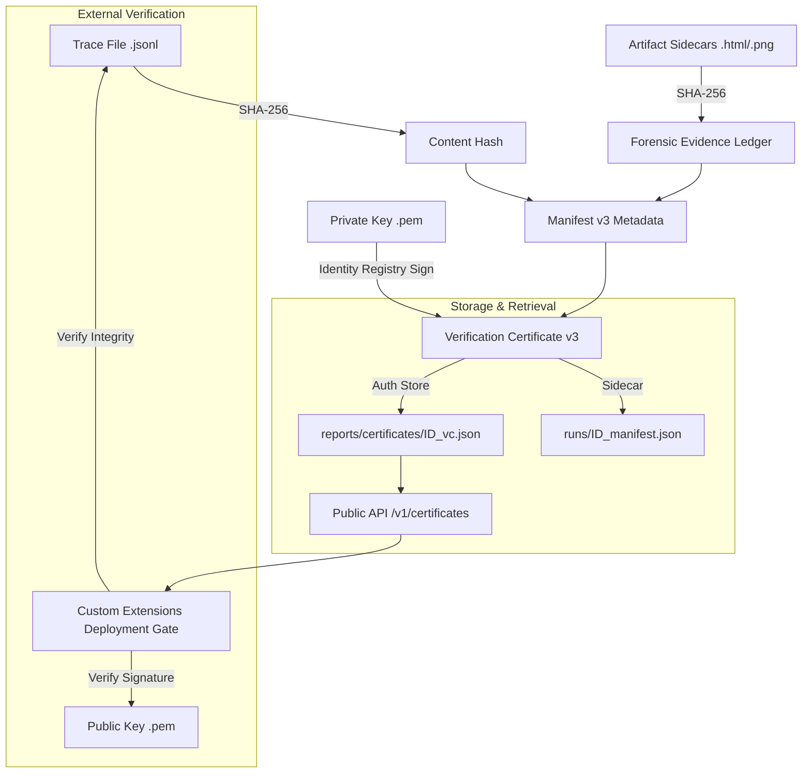

# Trust Protocol Standard v1.4.1 (Forensic Baseline)
The Trust Protocol is designed to provide **immutable proof of run integrity** for the MultiAgentEval Harness. It employs a "Detached Signature" architecture that separates the bulky execution data (Trace) from the authoritative metadata (Verification Certificate v3).



### The Multi-Layer Forensic Defense
1.  **Trace Layer (Integrity)**: A SHA-256 hash of the `.jsonl` trace file ensures core execution has not been altered.
2.  **Evidence Layer (Provenance)**: The **Forensic Evidence Ledger** contains SHA-256 hashes of all sidecar artifacts (reports, plots), preventing report manipulation.
3.  **Manifest Layer (Authority)**: A signed JSON object (The VC v3) that binds the trace and evidence hashes to an authoritative identity via the **Identity Registry**.

---

## 2. Cryptographic Mechanics

### A. SHA-256 Content Hashing
- **Mechanism**: The `TraceVerifier` performs a streaming SHA-256 hash of the trace file on-disk.
- **Rationale**: 
    - **Performance**: Hashing is O(n) and extremely fast, allowing for the verification of multi-gigabyte traces without hitting CPU bottlenecks.
    - **Content Addressability**: The hash serves as a unique fingerprint. If a single timestamp in the trace is modified, the hash changes, invalidating the entire protocol.

### B. ED25519 Asymmetric Signing
- **Mechanism**: We use the ED25519 (Edwards-curve Digital Signature Algorithm) to sign the *entire manifest string*.
- **Rationale**:
    - **Security**: ED25519 is resistant to many side-channel attacks and collision attacks that plague older algorithms like RSA or ECDSA.
    - **Efficiency**: Signatures are only 64 bytes, making the Verification Certificates (VCs) lightweight and easy to transmit via public API.
    - **Detached Binding**: By signing a manifest that *contains* the trace hash (rather than signing the trace itself), we bind the harness's authority to the trace content without the overhead of signing massive files.

---

## 3. The Verification Workflow

1.  **Generation**: Upon run completion, the harness generates hashes for the trace and all sidecar artifacts.
2.  **Issuance**: The `IdentityService` resolves the authoritative `system_id` private key and signs the VC v3 manifest.
3.  **Redundant Storage**:
    *   **Sidecar**: Stored as `run_ID_manifest.json` for local reproducibility.
    *   **Authoritative Store**: Stored in `reports/certificates/` for the Trust API.
4.  **Retrieval**: External systems call the public `GET /api/v1/certificates/<run_id>` endpoint to fetch the proof.
5.  **Validation**: The consumer uses the harness's **Public Key** to verify the signature and then re-computes the SHA-256 of the trace file to ensure a match.

---

## 4. Identity Registry & KMS Integration
Core v1.4 replaces legacy file-based key loaders with the **Identity Registry** (`IdentityService`). This service abstracts private key resolution, supporting both local PEM storage and future cloud-native Vault/HSM integrations.

- **`LocalFileKeyLoader` (Default)**: Handles standard PEM files in the `.aes/keys` directory. This is used for development and standard CI/CD pipelines.
- **Enterprise Extensions**: Teams can implement custom loaders (e.g., `AWSKMSKeyLoader`, `GCPKMSKeyLoader`) that fetch keys directly from protected vaults via API, ensuring that private keys never touch the harness's local filesystem.

### B. Dynamic Injection
The `TraceVerifier` supports runtime injection of custom loaders:
```python
TraceVerifier.set_key_loader(MyCustomKMSLoader())
```
This enables "Zero-Touch" security where the harness remains provider-agnostic while supporting high-stakes industrial governance.

---

## 5. Hardened Security Design (Core Responsibility)

> [!IMPORTANT]
> **Path Traversal Protection**: All file operations in `verifier.py` are jail-checked. The engine will refuse to sign or verify files outside of authorized evaluation directories.

> [!CAUTION]
> **Key Management (Private Key)**: Private keys are stored in `.aes/` and explicitly excluded from Git via `.gitignore`. 

> [!NOTE]
> **Public Key Distribution & Git**: While public keys are not secret, it is **not recommended** to commit them to the shared source repository. Committing a specific public key to Git creates "Identity Pinning," making it difficult to rotate keys or support multiple evaluation environments. 

### How to Distribute via Environment Configuration

To implement a secure "Trust Anchor" in a production pipeline without committing keys to Git, use one of the following methods:

1. **CI/CD Secrets (GitHub Actions/GitLab)**:
    - **GitHub**: Store the PEM content in a Secret named `CORE_PUBLIC_KEY`. In your workflow, write it to a temporary file: `echo "${{ secrets.CORE_PUBLIC_KEY }}" > .aes/public_key.pem`.
2. **Kubernetes Configuration**:
    - **ConfigMap/Secret**: Create a Secret containing the public key and mount it into your Gatekeeper pod at a defined path (e.g., `/etc/trust/public_key.pem`).
3. **Base64-Encoded Environment Variable**:
    - **Method**: Encode the PEM: `cat public_key.pem | base64`. Store this string as `CORE_PUBLIC_KEY_B64`.
    - **Consumption**: The consumer decodes it on start: `echo $CORE_PUBLIC_KEY_B64 | base64 -d > /tmp/public_key.pem`.

---

## 6. Key Management & Distribution Guide (Industrial Standard)

To maintain a secure "Trust Anchor" between the Open Core and the Custom Extensions Team, we follow a strict separation of keys.

### A. Role-Based Key Ownership

| Role | Responsibility | Key Required | Storage |
| :--- | :--- | :--- | :--- |
| **Open Core (Issuer)** | Signing Trace Proofs | **Private Key** (ed25519) | HSM / KMS / Protected Env |
| **Custom Extensions (Consumer)** | Verifying Trace Integrity | **Public Key** (ed25519) | Embedded in CI/CD / Docker |

### B. Distribution Flow
1. **Initial Provisioning**: The Open Core administrator generates the key pair once (`TraceVerifier.generate_key_pair`).
2. **Public Key Hand-off**: The `public_key.pem` is distributed to the Custom Extensions team for integration into their **Gatekeeper** service.
3. **Private Key Isolation**: The `private_key.pem` is never shared. It exists only within the secure execution environment of the primary Evaluation Harness.

### C. The Consumer's Verification Logic
The Custom Extensions Gatekeeper (the consumer) must implement the following logic to enforce a secure "Trust Protocol":

1. **Retrieve VC**: `GET /api/v1/certificates/<run_id>`
2. **Verify Authority**: Call `TraceVerifier.verify_asymmetric` using the provided **Public Key**.
3. **Verify Integrity**: Re-hash the local trace file (`sha256sum`) and ensure it matches the `sha256` value inside the verified VC.

---

## 7. CLI Integration (Industrial Standard)

The Evaluation Harness provides a first-class CLI suite to manage the Trust Protocol workflow:

-   **`certify --path <trace.jsonl> [--private-key <key.pem>]`**: 
    Performs a SHA-256 hash of the trace and wraps it in a signed Verification Certificate (VC). If a private key is provided, an ED25519 signature is appended to the manifest.
-   **`verify --path <trace.jsonl> [--manifest <manifest.json>]`**: 
    Locally verifies the integrity of a trace file against its manifest (Sidecar).
-   **`gate --vc <vc.json> [--public-key <key.pem>]`**: 
    A production-grade CI/CD utility that enforces signature and hash verification, exiting with a non-zero code on failure.

---

## 8. Summary of Rationale
We chose this hybrid approach (SHA-256 + ED25519) to balance **performance** with **unbreakable trust**. By making the key management layer **Pluggable (HMS-Ready)**, we ensure the harness can grow from a local developer tool into a mission-critical component of a zero-trust industrial evaluation pipeline.
