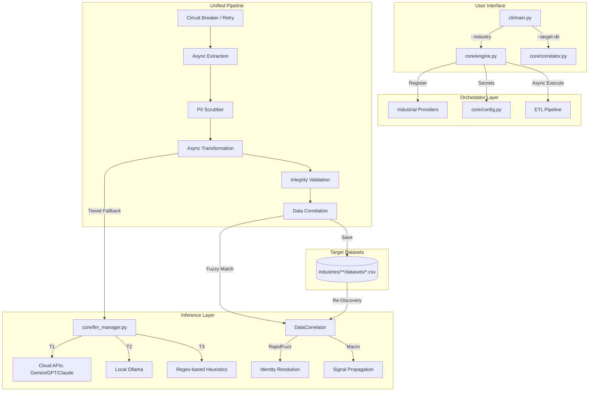

# `dataproc-engine` Architecture Diagram

The following diagram illustrates the data flow and component interactions within the hardened industrial inference engine.

### Key Workflow:
1.  **Unified Async Entry**: The CLI initializes a single async block that handles both API-based and local file-based sources.
2.  **Tiered Extraction**: The `LLMManager` attempts Cloud extraction, falling back to local models or regex heuristics for zero-cost recovery.
3.  **Cross-Vertical Correlation**: The `DataCorrelator` scans the target directory to link new records with existing industry data (e.g., linking Finance to Telecom).
