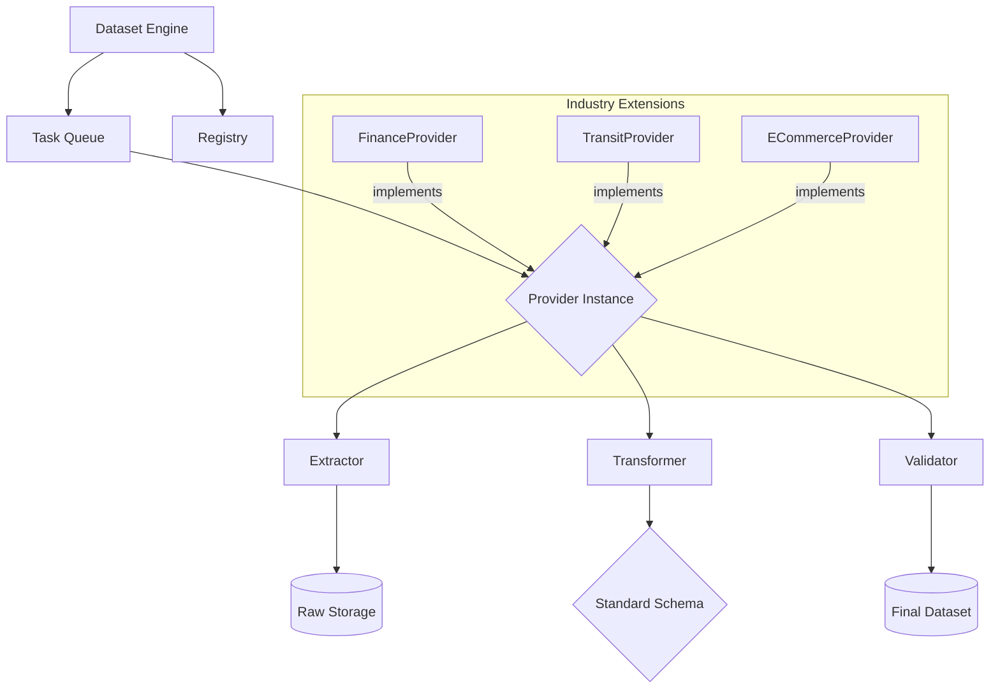

# Generic ETL Framework Architecture

## Overview
The ETL framework is designed to be modular, extensible, and robust. It uses a **Provider Pattern** to abstract industry-specific data source logic from the core processing engine.

## Core Components

### 1. Dataset Engine (Orchestrator)
The central controller that:
*   Loads industry configurations from a `Registry`.
*   Instantiates the appropriate `Provider` lifecycle.
*   Handles parallel execution and resource management (e.g., rate limiting).

### 2. Provider Lifecycle
Each industry pilot implements a `Provider` that follows a standardized 4-stage lifecycle:

1.  **Extract**: Fetches raw data from external APIs or files. Stores raw artifacts for auditability.
2.  **Transform**: Maps raw data (XML, XBRL, JSON, PDF) into the `StandardIndustrySchema`.
3.  **Validate**: Performs integrity checks (checksums, cross-references, business logic consistency).
4.  **Export**: Saves the normalized dataset in evaluation-ready formats (JSONL, Parquet).

## Data Flow Diagram

## Extensibility Pattern
To add a new industry (e.g., "Healthcare"):
1.  Define the `HealthcareSchema` (extending the base schema).
2.  Implement `HealthcareProvider` (overriding `extract()` and `transform()`).
3.  Register the provider in `registry.json`.
