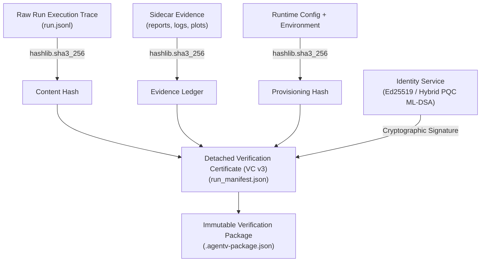

AgentV is engineered for mission-critical enterprise environments where auditability, non-repudiation, and regulatory compliance are legal and operational requirements.

---

## 🏛️ 1. Forensic Governance Architecture

AgentV establishes an unbroken chain of custody for every agent evaluation run:



### Key Pillars:
1. **Binary Trace Integrity**:
   - All trace records are written as raw UTF-8 byte streams to disk without OS-level CRLF translation.
   - Trace hashes (`sha3_256`) remain 100% byte-identical across Windows, Linux, and macOS.
2. **Seal Hash Protocol**:
   - Before issuing a Verification Certificate, the engine computes a SHA3-256 hash of the complete historical trace up to that turn (`seal_hash`).
   - The `seal_hash` is embedded in the certificate metadata, mathematically anchoring the certification to the specific execution sequence.
3. **Forensic Evidence Ledger**:
   - Maps every generated artifact (HTML reports, PDF summaries, trajectory charts) to its individual SHA3-256 digest, preventing report tampering.
4. **WORM Audit Trail Sealing (`audit_chain.jsonl`)**:
   - Write-Once-Read-Many append-only cryptographic log recording every tool call, state mutation, and evaluation decision in real-time.

---

## 📜 2. Regulatory & Standard Alignment

### NIST AI 100-1 (AI Risk Management Framework)
AgentV evaluates agents across all 7 core NIST AI trustworthiness dimensions using the **Weighted Severity Model (WSM)**:

| Dimension | Weight | Enforcement |
| :--- | :--- | :--- |
| **Safety** | 25% | Hard floor: Score < 0.5 caps aggregate trustworthiness at 0.49 (Fail). |
| **Security** | 20% | Hard floor: Score < 0.5 caps aggregate trustworthiness at 0.49 (Fail). |
| **Reliability** | 20% | Multi-attempt Pass@K variance threshold. |
| **Fairness** | 15% | Demographic parity and bias perturbation checks. |
| **Explainability** | 10% | Behavioral DNA event hierarchy (PHASE, SUBTASK, ACTION). |
| **Privacy** | 5% | PII exfiltration and HIPAA/GDPR redaction verification. |
| **Resilience** | 5% | Recovery from injected environment faults and state drift. |

### NIST SP 800-218 (Secure Software Development Framework)
- Deterministic build and packaging pipelines.
- Immutable, content-addressed evidence packages with detached cryptographic signatures.
- Continuous vulnerability scanning and zero-trust sandbox execution.

### EU AI Act (High-Risk AI Systems)
- Conforms to Article 14 (Human-in-the-Loop oversight) via `SessionApprovalManager` and `hitl_pause` actions.
- Conforms to Article 15 (Accuracy, Robustness, and Cybersecurity) with automated adversarial mutation (`agentv mutate`) and non-repudiable audit logs.

---

## 📦 3. Deterministic Verification Packages (`.agentv-package.json`)

For enterprise compliance archives, AgentV bundles the complete audit evidence into a single self-contained JSON file:

- **Contents**: Full scenario definition, execution manifest, OpenTelemetry trace digests, typed assertion verdicts, and signature envelope.
- **Deterministic Digest Calculation**:
  - The package digest is computed across canonicalized JSON representations of the scenario, manifest, telemetry hashes, and assertion verdicts.
  - Envelope creation timestamps are decoupled from the canonical hash computation, ensuring that package digests are 100% reproducible on re-export.

---

## 🚦 4. Automated CI/CD Gating (`agentv gate`)

Enforce compliance in deployment pipelines by failing builds that do not meet verification thresholds:

```bash
agentv gate --run-id run_fintech_2026_01 --verify-ledger --pqc
```

Exits with non-zero code if:
1. Trace hash does not match `run.jsonl` on disk.
2. Any file in `evidence_ledger` is modified or missing.
3. Cryptographic signature verification fails.
4. Trustworthiness score violates the safety floor.
