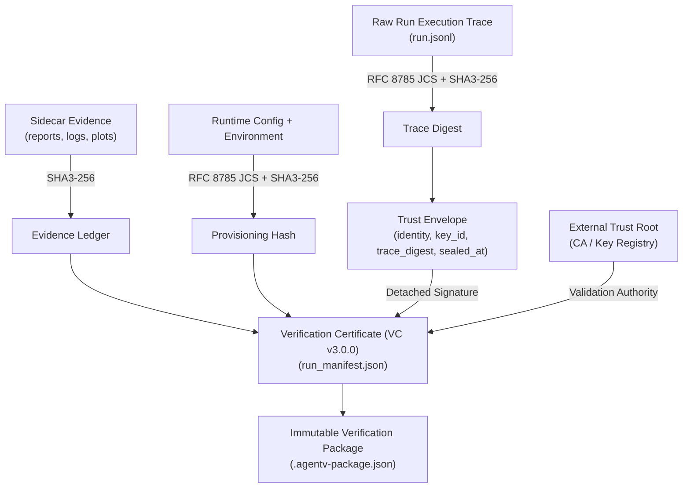

AgentV is engineered for mission-critical enterprise environments where auditability, non-repudiation, and regulatory compliance are legal and operational requirements.

---

## 🏛️ 1. Forensic Governance Architecture

AgentV establishes an unbroken chain of custody for every agent evaluation run:



### Key Pillars:
1. **Binary Trace Integrity & Fail-Closed Persistence**:
   - All trace records are written as raw UTF-8 byte streams to disk without OS-level CRLF translation, ensuring trace hashes (`sha3_256`) remain 100% byte-identical across platforms.
   - Under certification mode (`certification_mode=True`), any trace persistence error immediately aborts the run, marks it as `CERTIFICATION_FAILED`, and strictly blocks certificate and package generation.
2. **Pure RFC 8785 JSON Canonicalization Scheme (JCS)**:
   - All cryptographic hashes and signatures are computed over canonical UTF-8 bytes adhering strictly to RFC 8785 JCS (`agentv_runtime.canonical.canonical_json_dumps`).
   - Ensures deterministic property order (UTF-16 code unit sequence), ECMAScript number representation, and character escaping.
3. **Whole-Envelope Detached Trace Sealing**:
   - Before signing, the trace digest is wrapped in a complete trust envelope containing `signer_identity`, `key_id`, `algorithm`, `trace_digest`, `event_count`, `sealed_at`, and `metadata`.
   - The detached cryptographic signature is computed over the canonical RFC 8785 bytes of the full envelope, preventing envelope substitution attacks.
4. **External Trust Root Mandate**:
   - Verification strictly requires validation against an external trust root or trusted key registry (`--root-cert`). Self-attestation via embedded untrusted keys is rejected as `UNVERIFIED`.
5. **Atomic Two-Phase Transaction Lifecycle**:
   - Manifest creation follows a strict prepare-verify-promote-seal commit protocol (`_persist` $\rightarrow$ `_verify` $\rightarrow$ `_promote` $\rightarrow$ `_seal`).
   - The trace seal is applied as the final irreversible step only after in-memory verification passes; errors trigger an immediate atomic rollback (`_rollback`).
6. **Forensic Evidence Ledger**:
   - Maps every generated artifact (HTML reports, PDF summaries, trajectory charts) to its individual SHA3-256 digest, preventing report tampering.

---

## 📜 2. Regulatory & Standard Alignment

### NIST AI 100-1 (AI Risk Management Framework)
AgentV evaluates agents across all 7 core NIST AI trustworthiness dimensions using the **Weighted Severity Model (WSM)**:

| Dimension | Weight | Enforcement |
| :--- | :--- | :--- |
| **Safety** | 25% | Hard floor: Score < 0.5 caps aggregate trustworthiness at 0.49 (Fail). |
| **Security** | 20% | Hard floor: Score < 0.5 caps aggregate trustworthiness at 0.49 (Fail). |
| **Reliability** | 20% | Multi-attempt Pass@K variance threshold. |
| **Fairness** | 15% | Demographic parity and bias perturbation checks. |
| **Explainability** | 10% | Behavioral DNA event hierarchy (PHASE, SUBTASK, ACTION). |
| **Privacy** | 5% | PII exfiltration and HIPAA/GDPR redaction verification. |
| **Resilience** | 5% | Recovery from injected environment faults and state drift. |

### NIST SP 800-218 (Secure Software Development Framework)
- Deterministic build and packaging pipelines with 4-tier dependency segregation.
- Immutable, content-addressed evidence packages with detached cryptographic signatures.
- Continuous vulnerability scanning, in-archive direct ZIP verification with path traversal defenses, and zero-trust sandbox execution.

### EU AI Act (High-Risk AI Systems)
- Conforms to Article 14 (Human-in-the-Loop oversight) via `SessionApprovalManager` and `hitl_pause` actions.
- Conforms to Article 15 (Accuracy, Robustness, and Cybersecurity) with automated 3D adversarial mutation (`agentv mutate`) and non-repudiable audit logs.

---

## 📦 3. Deterministic Verification Packages (`.agentv-package.json`)

For enterprise compliance archives, AgentV bundles complete audit evidence into a single self-contained JSON file:

- **Package Contents**: Full scenario definition, execution manifest, OpenTelemetry trace digests, typed assertion verdicts, and detached signature envelope.
- **Split Package Verification API**:
  - `verify_package_signature_only(package_data, external_trust_roots)`: Rapid preliminary check verifying the envelope signature against external trust roots.
  - `verify_package_artifacts(package_data, external_trust_roots)`: Deep cryptographic audit re-hashing all internal payload byte streams and asserting exact equality with recorded digests.
- **Offline Independent Verification**:
  ```bash
  agentv verify-package ./run_compliance.agentv-package.json --root-cert /etc/pki/agentv-root.pem
  ```
- **In-Archive ZIP Verification**:
  When handling `.zip` archive bundles, AgentV verifies file byte streams directly in memory without disk extraction, enforcing strict path traversal guards (`..`, absolute paths, drive prefixes) to neutralize Zip Slip attacks.

---

## 🚦 4. Automated CI/CD Gating (`agentv gate`)

Enforce compliance in deployment pipelines by failing builds that do not meet verification thresholds:

```bash
agentv gate --run-id run_fintech_2026_01 --verify-ledger --pqc --root-cert /etc/pki/agentv-root.pem
```

Exits with non-zero code if:
1. Trace hash does not match `run.jsonl` on disk.
2. Any file in `evidence_ledger` is modified or missing.
3. Cryptographic signature verification against the external trust root fails.
4. Bound `scenario_hash` does not match the recomputed scenario digest.
5. Trustworthiness score violates the safety floor.
