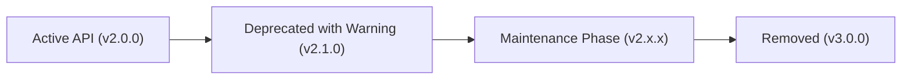

AgentV adheres strictly to **Semantic Versioning 2.0.0** (`MAJOR.MINOR.PATCH`). This document establishes the formal contract boundary between the zero-touch AgentV OS Runtime core and external integrations (custom plugins, adapters, enterprise extensions, and third-party tooling).

---

## 1. Formal SemVer Guarantees

```
v MAJOR . MINOR . PATCH
    │       │       └── Backward-compatible bug fixes and forensic patches
    │       └────────── Backward-compatible new features, new Extension ABCs, or deprecations
    └────────────────── Incompatible API, schema, or cryptographic contract changes
```

| Release Type | Semantic Scope | Contract Guarantees |
| :--- | :--- | :--- |
| **MAJOR (`v2.0.0` → `v3.0.0`)** | Breaking Contract Changes | Modifications or removals in public ABCs, AES root schemas, or hash digest algorithms. |
| **MINOR (`v2.0.0` → `v2.1.0`)** | Additive Capabilities & Deprecations | New optional configuration fields, new plugin hooks, new reference adapters. Introduces deprecation notices for future major releases. |
| **PATCH (`v2.0.0` → `v2.0.1`)** | Defect & Security Remediation | Bug fixes, internal performance optimizations, and documentation fixes. Zero changes to public signatures. |

---

## 2. Sealed Public Contract Boundaries

The following subsystems form the **Sealed Public Contract Surface** of AgentV. Any backward-incompatible change to these surfaces requires a **MAJOR** version bump.

### 2.1. Extension Families (`agentv_runtime.interfaces`)
The 6 Abstract Base Classes (ABCs) that define external integration boundaries:
- `ExecutionBackend`: `submit()`, `status()`, `cancel()`, `resume()`
- `CheckpointStore`: `save()`, `load()`, `list_checkpoints()`, `delete()`
- `SigningBackend`: `sign_payload()`, `verify_payload()`, `get_public_key()`, `supported_algorithms()`
- `ArtifactStore`: `put()`, `get()`, `exists()`, `get_uri()`
- `PolicyEvaluator`: `evaluate_policy()`, `validate_policy()`
- `AuthorizationBackend`: `authorize()`, `validate_token()`

### 2.2. Deterministic Configuration Mesh (`ResolvedRuntimeConfig`)
- The deterministic **SHA3-256 `config_hash`** digest calculation across all runtime parameters.
- Four-tier configuration precedence resolution (OSS Defaults → File Config → Env Vars → Runtime Overrides).

### 2.3. Agent Evaluation Scenario Schema (`AES v1.4`)
- Mandatory top-level structure: `aes_version`, `metadata`, `workflow`, `evaluation`.
- Universal immutable schema registry validation for all `.json` and `.yaml` scenario manifests.

### 2.4. Plugin Discovery & Lifecycle Hook Architecture
- `PluginManager` dynamic and persistent registration mechanisms.
- `BaseEvalPlugin` standard lifecycle hooks: `before_evaluation`, `after_evaluation`, `on_register_commands`, `on_discover_adapters`, `on_register_simulators`, `on_discover_metrics`, `on_diagnose_failure`.

### 2.5. Verification Certificate Protocol (`VC v3.0.0`)
- NIST AI-100-1 7-Dimension **Weighted Severity Model (WSM)** scoring vector (`safety`, `security`, `reliability`, `fairness`, `explainability`, `privacy`, `resilience`).
- Cryptographic provenance chain structure and SHA3-256 trace fingerprinting.

---

## 3. Deprecation Lifecycle Policy

To ensure enterprise stability and SOC 2 Type 1 operational predictability:

1. **Deprecation Notice**: Any interface, function, or configuration field scheduled for retirement must be marked with a `DeprecationWarning` in at least **one full MINOR release cycle** prior to removal.
2. **Documentation**: Deprecated APIs are explicitly documented in the release notes and migration guides.
3. **Removal Gate**: Deprecated interfaces can only be removed in a **MAJOR** version release.



---

## 4. Continuous Contract Verification

The contract boundary is protected by an automated, zero-regression test suite located in `tests/contracts/`:

- `test_aes_schema_contract.py`: Enforces AES v1.4 scenario structure and version requirements.
- `test_plugin_discovery_contract.py`: Enforces plugin hooks and `agentv_runtime` namespace integrity.
- `test_config_hash_contract.py`: Enforces deterministic SHA3-256 config hash stability.
- `test_execution_lifecycle_contract.py`: Enforces 4-method execution backend lifecycle invariants.
- `test_verification_contract.py`: Enforces VC v3.0.0 schemas, NIST 7-dimension weights, and safety floors.

```bash
# Execute contract validation suite
pytest tests/contracts/ -v
```
