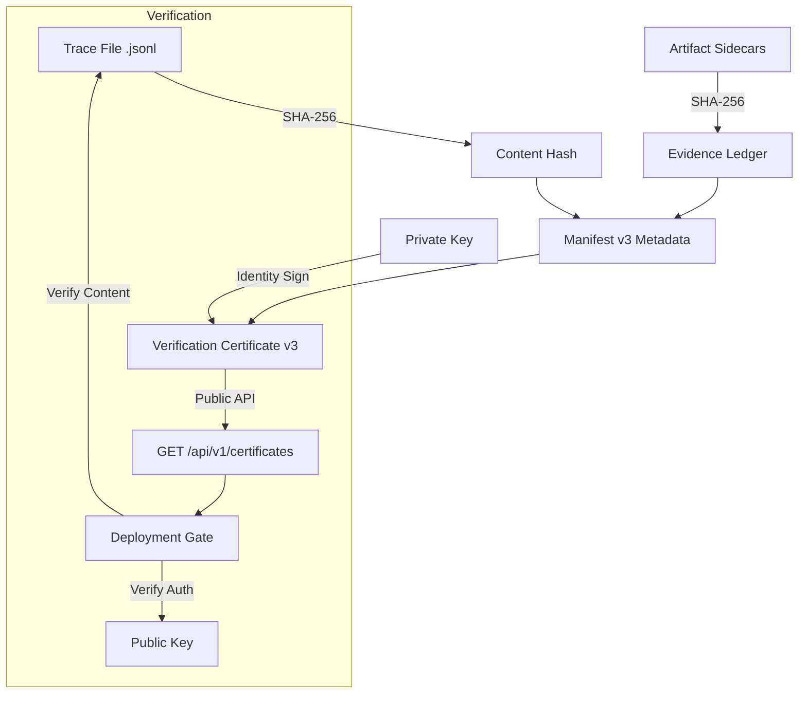

The Trust Protocol (v1.4.1) provides **immutable proof of run integrity** for the MultiAgentEval Harness. It employs a "Detached Signature" architecture that separates bulky execution data from authoritative metadata certificates.

## 1. Forensic Architecture

MultiAgentEval uses a tiered approach to ensure that evaluation results are authentic and tamper-proof.



### The Multi-Layer Forensic Defense
1.  **Trace Layer (Integrity)**: A SHA-256 hash of the `.jsonl` trace file ensures core execution has not been altered.
2.  **Evidence Layer (Provenance)**: The **Forensic Evidence Ledger** contains SHA-256 hashes of all sidecar artifacts (reports, plots), preventing report manipulation.
3.  **Manifest Layer (Authority)**: A signed JSON object (**Verification Certificate v3**) that binds these hashes to an authoritative identity via the **Identity Registry**.

---

## 2. Cryptographic Mechanics

### SHA-256 Content Hashing
The `TraceVerifier` performs streaming SHA-256 hashing of the trace file on-disk. This content-addressable signature ensures that if a single timestamp in the trace is modified, the hash changes, invalidating the entire protocol.

### Ed25519 Asymmetric Signing
We use the Ed25519 algorithm to sign the entire manifest.
- **Security**: Resistant to side-channel and collision attacks.
- **Efficiency**: signatures are only 64 bytes.
- **Detached Binding**: Signs the trace hash rather than the trace itself, eliminating the overhead of signing massive files.

---

## 3. Identity Registry & KMS

Core v1.4 replaces legacy file-based key loaders with the **Identity Registry** (`IdentityService`). This service abstracts private key resolution, supporting both local PEM storage and future cloud-native Vault/HSM integrations.

- **`LocalFileKeyLoader` (Default)**: Handles standard PEM files in the `.aes/keys` directory.
- **Enterprise Extensions**: Support for custom loaders (e.g., `AWSKMSKeyLoader`) that fetch keys directly from protected vaults via API.

---

## 4. Operational Gating (CI/CD)

The harness provides a production-grade utility for enforcing trust in automated pipelines.

### The `gate` Command
The `gate` utility is the final gatekeeper for production deployments. It exits with a non-zero code if:
1. The **Verification Certificate (VC)** signature is invalid.
2. The **Trace Hash** does not match the file on-disk.
3. Any item in the **Evidence Ledger** is missing or tampered with.

```bash
multiagent-eval gate --run-id <id> --verify-ledger --public-key <path>
```

---

## 5. Security Guardrails

> [!IMPORTANT]
> **Path Traversal Protection**: All file operations in the `verifier.py` engine are jail-checked. The protocol will refuse to sign or verify files outside of authorized evaluation directories.

> [!CAUTION]
> **Key Isolation**: Private keys are stored in `.aes/keys` and are explicitly excluded from Git via `.gitignore`. Never commit private keys to the source repository.
