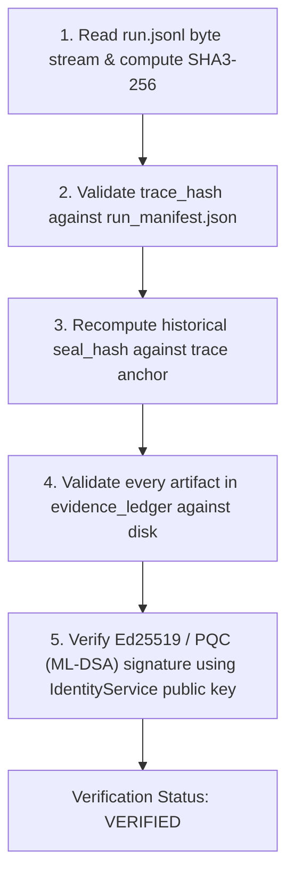
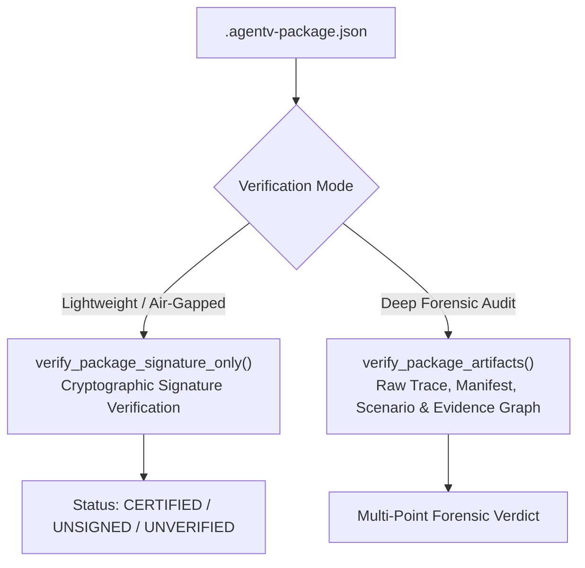

The **AgentV Verification Subsystem** provides mathematical, tamper-evident proof that evaluation runs executed authentically and achieved their required criteria.

---

## 🔬 1. Server-Authoritative Verification Endpoint

The Visual Console and external auditing systems verify runs by querying the authoritative backend verification endpoint:

```http
GET /api/v1/runs/{run_id}/verify HTTP/1.1
Host: localhost:5000
```

### Verification Evaluation Logic:
The backend executes `TraceVerifier.verify_run_directory()`, performing a 5-point cryptographic check:



### Response Schema:
```json
{
  "run_id": "run_fintech_2026_01",
  "verification_status": "VERIFIED",
  "is_valid": true,
  "algorithm": "ML-DSA-65+Ed25519",
  "is_pqc": true,
  "signer_identity": "system_id",
  "trace_hash": "a8f94e2b...",
  "seal_hash": "e3b0c442...",
  "evidence_count": 4,
  "failure_reason": null
}
```

---

---

## 📦 2. Split Package Verification API (`VerificationAuthority`)

For decoupled, zero-trust verification pipelines, AgentV provides the **Split Package Verification API**:



### 1. Signature-Only Verification
Validates cryptographic integrity without requiring underlying raw trace files or artifacts on disk:
```python
from eval_runner.verifier import VerificationAuthority

result = VerificationAuthority.verify_package_signature_only(package)
# Returns: {"verified": True/False, "status": "CERTIFIED"|"UNSIGNED"|"UNVERIFIED", ...}
```

### 2. Deep Artifact Verification
Recomputes canonical digests from raw execution artifacts to prove zero-tampering:
```python
result = VerificationAuthority.verify_package_artifacts(
    package=pkg,
    raw_trace_bytes=raw_bytes,
    raw_trace_events=raw_events,
    canonical_manifest=manifest,
    scenario_data=scenario_dict,
    require_signature=True,
)
```

### Multi-Point Verification Checks:
1. **Raw Trace Parity**: Recomputes `SHA3-256(raw_trace_bytes)` and matches against `pkg.trace_hash`.
2. **Canonical Manifest Recomputation**: Re-derives canonical manifest hash via `canonical_manifest.compute_manifest_hash()` against `pkg.manifest_hash`.
3. **Scenario Canonical Hash Binding**: Computes `compute_scenario_hash(scenario_data)` and asserts equality with `pkg.scenario_hash`. Tampered scenario definitions fail immediately.
4. **Direct Trace Provenance Enforcement**: Reconstructs the Evidence Graph from raw trace events (`build_evidence_graph_from_events`) and enforces `is_complete_provenance = True`. Any assertion evaluated without direct event linkage (e.g. carrier fallback) fails closed with `DirectProvenanceViolation`.
5. **Authoritative Verdict Precedence**: Derives final certification from authoritative terminal event verdicts. Caller-supplied status overrides and heuristic counters (`passed=True`, `success_rate`) cannot certify failed runs.

---

## 💻 3. CLI Offline Verification (`agentv verify`)

Audit execution traces directly on disk without launching the web server:

```bash
# Standard classical verification
agentv verify --run-id run_fintech_2026_01

# Post-quantum hybrid verification
agentv verify --run-id run_fintech_2026_01 --pqc
```

---

## 🚦 4. CI/CD Hard Gating (`agentv gate`)

The `agentv gate` command acts as a non-bypassable quality gate for deployment pipelines.

```bash
# GitHub Actions / GitLab CI Step
agentv gate \
  --run-id $RUN_ID \
  --verify-ledger \
  --pqc
```

### Exit Codes:
- `0`: Run is cryptographically authentic, ledger is complete, and all required assertions passed.
- `1`: Tamper detected, signature invalid, or failure criteria violated.

---

## 🌐 5. Framework Adapter Verification Matrix

Verify connectivity and readiness across target frameworks:

```bash
# AG2 (AutoGen)
agentv run --path scenarios/loan_risk.json --protocol ag2

# LangGraph
agentv run --path scenarios/loan_risk.json --protocol langgraph --agent http://localhost:8000/execute_task

# CrewAI
agentv run --path scenarios/loan_risk.json --protocol crewai --agent http://localhost:8000/execute_task

# Frontier Model Direct Adapters
agentv run --protocol gemini --agent "gemini://gemini-3.7-flash"
agentv run --protocol claude --agent "claude://claude-opus-5"
agentv run --protocol openai --agent "openai://gpt-5.6"
agentv run --protocol ollama --agent "ollama://deepseek-r1:70b"
```
