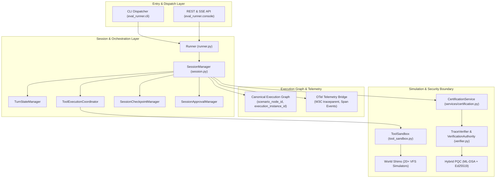

AgentV is designed with a **"Zero-Touch Core"** architecture. The core orchestration engine remains strictly framework-agnostic, while all sector-specific benchmarks, protocol adapters, environment simulators (World Shims), and forensic analyzers are hot-swapped dynamically via pluggable interfaces.

---

## 1. 🏗️ High-Level Layering

1. **Entry Layer (`eval_runner/cli.py`, `eval_runner/console/`)**:
   - High-performance command dispatcher with dynamic Entry Point discovery and parser caching.
   - Flask REST and SSE server exposing `/api/v1/runs`, `/api/v1/scenarios`, `/api/v1/evidence`, and `/api/v1/trust`.

2. **Session & Orchestration Layer (`eval_runner/session.py`, `eval_runner/session_components/`)**:
   - Manages the turn-based loop, multi-attempt (`pass@k`) trials, and DAG task execution.
   - Decomposed into 4 specialized subsystems:
     - **`TurnStateManager`**: Sequence numbers, token tracking, and conversation history buffer isolation.
     - **`ToolExecutionCoordinator`**: Sandboxed tool invocation, argument validation, and simulator routing.
     - **`SessionCheckpointManager`**: Durable session state persistence via `SQLiteCheckpointStore` for mid-run recovery and resume.
     - **`SessionApprovalManager`**: Human-in-the-loop (HITL) approval coordination and cryptographic token management.

3. **Canonical Execution Graph & Telemetry (`eval_runner/session.py`, `eval_runner/otel_bridge.py`)**:
   - **Canonical Identity Triple**:
     - `scenario_node_id`: Stable node identifier from the scenario DAG.
     - `execution_instance_id`: Unique attempt instance key (`{scenario_node_id}:attempt:{attempt}`).
     - `parent_execution_id`: Lineage key tracking retries and branching.
   - **OTel Bridge**: Maps engine lifecycle events (`RUN_START`, `TOOL_CALL`, `TURN_END`, `RUN_END`) into W3C-compliant OpenTelemetry spans.

4. **Simulation & Sandbox Layer (`eval_runner/tool_sandbox.py`, `eval_runner/simulators.py`)**:
   - VFS-aware sandboxing with deterministic state diffing.
   - 20+ built-in world shims (`git`, `database`, `api`, `slack`, `terminal`, `cloud`, `crm`, `erp`, `stripe`).
   - Context-bound coroutine isolation powered by Python `contextvars.ContextVar`.

5. **Trust, Certification & Verification Layer (`eval_runner/verifier.py`, `eval_runner/services/certification.py`, `eval_runner/identity.py`)**:
   - **`TraceVerifier` & `VerificationAuthority`**: Content-addressable streaming hashing (`hashlib.sha3_256`), Split Package Verification API (`verify_package_signature_only`, `verify_package_artifacts`), canonical scenario hash binding, and Evidence Graph direct provenance enforcement.
   - **`CertificationService`**: Authoritative evaluation outcome extraction ensuring terminal execution failures take absolute precedence over caller overrides or heuristic counters.
   - **`IdentityService`**: Dual-mode cryptographic signing (Classical Ed25519 and Post-Quantum ML-DSA-65) with strict trust root jail protection.
   - Detached Verification Certificate v3 (`run_manifest.json`), Verification Packages (`.agentv-package.json`), and WORM audit trail sealing (`audit_chain.jsonl`).

---

## 2. ⛓️ Extensibility & Interceptor Pipelines

AgentV implements an extensible, zero-trust **Interceptor Pipeline Pattern** allowing external plugins and enterprise systems to securely intercept execution without modifying core code.

### 1. Tool Sandbox Interception Pipeline
- **`ToolSandboxInterceptor`**: Intercepts, inspects, mutates, or blocks tool execution requests before they reach world shims.
- **`ToolSandboxService` (`tool_sandbox_service`)**: Thread-safe, context-isolated registry executing active tool interceptors.

### 2. Cryptographic Verification Pipeline
- **`TraceVerificationInterceptor`**: Intercepts sign and verify operations.
- **`VerificationService` (`verification_service`)**: Routes signing to local keys or external enterprise KMS/HSM hardware vaults.

### 3. Scenario Mutation Pipeline
- **`ScenarioMutator`**: Intercepts scenario generation to apply adversarial perturbations (typos, prompt injection, cognitive ambiguity).
- **`MutationService` (`mutation_service`)**: Concurrency-safe registry chaining mutator providers.

---

## 3. 🛡️ Process Orchestration & Stability Guard

To ensure evaluation determinism in concurrent CI/CD environments:
- **PID-Based Locking**: Active orchestration runs maintain `.aes/lock/server.pid`.
- **Ghost Process Remediation**: The engine uses `psutil` to detect and clean up orphaned background processes from aborted runs before starting a new session.
- **Cross-Platform Compatibility**: Robust file-locking and signal handling ensuring identical behavior across Windows, Linux, and macOS.
