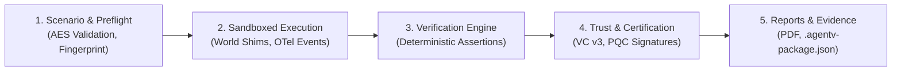

The **AgentV Evaluation Framework** provides industrial-grade verification for autonomous AI agents. Unlike simple prompt-response test harnesses, AgentV evaluates agent systems across multi-turn stateful execution trajectories, validating real-world tool interactions, virtual filesystem mutations, and safety constraints.

---

## 🧭 The Industrial Evaluation Lifecycle

Every evaluation flows through an end-to-end 5-stage pipeline:



1. **Scenario & Preflight**: Scenario definitions are validated against AES schemas, and a SHA3-256 `preflight_fingerprint` ensures readiness.
2. **Sandboxed Execution**: Agents interact with isolated **World Shims** (mock databases, REST APIs, Git repositories, email clients) while the engine captures OpenTelemetry-aligned event streams.
3. **Verification Engine**: The runtime executes deterministic assertions (`state_verification`, `tool_call_correctness`, `numerical_tolerance`, `json_schema`, `regex`, and semantic LLM judges).
4. **Trust & Certification**: The engine hashes execution traces, computes the seal hash anchor, and issues a cryptographically signed Verification Certificate (`run_manifest.json`).
5. **Reports & Evidence**: Generation of truthful executive PDF reports and self-contained immutable Verification Packages (`.agentv-package.json`).

---

## 🏗️ Scenario Specification (AES)

Scenarios are authored in the **Agent Evaluation Specification (AES)** format (JSON or YAML), defining a Directed Acyclic Graph (DAG) of tasks:

```yaml
id: loan_approval_risk_check
name: Commercial Loan Underwriting & Risk Assessment
industry: finance
version: "1.4"
difficulty: L3_Intermediate
target_capabilities:
  - tool_use
  - multi_turn_reasoning
  - compliance_enforcement

workflow:
  nodes:
    - id: step_1_credit_pull
      task_description: "Retrieve credit score and debt-to-income ratio for applicant ID: APP-89421."
      required_tools:
        - credit_bureau_api
      success_criteria:
        - type: tool_call_correctness
          expected_tools:
            - credit_bureau_api
        - type: state_verification
          path: "environment.credit_pull_completed"
          expected_value: true

    - id: step_2_risk_decision
      task_description: "Calculate overall risk rating and approve or decline loan per policy FIN-POL-402."
      required_tools:
        - loan_decision_service
      success_criteria:
        - type: regex
          pattern: "STATUS:\\s*(APPROVED|DECLINED)"
        - type: policy_compliance
          policy_id: "FIN-POL-402"

  edges:
    - from: step_1_credit_pull
      to: step_2_risk_decision
      condition: "step_1_credit_pull.status == 'success'"
```

---

## ⚖️ Evaluation Metrics & Scoring Engine

AgentV evaluates agent trajectories across multiple rigorous metric categories:

| Metric Name | Category | Evaluation Method |
| :--- | :--- | :--- |
| `tool_call_correctness` | Tooling | Exact set-match and argument validation of actual vs expected tool calls. |
| `state_verification` | State | Deep-equality check of virtual environment state using dot-notation JSON paths. |
| `numerical_tolerance` | Numerical | Mathematical verification ensuring values fall within specified absolute or relative bounds. |
| `json_schema` | Structured | Strict JSON Schema validation against structured agent JSON outputs. |
| `regex` | Textual | Pattern matching validating required structural phrases, codes, or formats. |
| `policy_compliance` | Governance | Rule engine verifying strict adherence to declared industry policies. |
| `delegation_loop_risk` | Efficiency | Loop-detector identifying infinite reasoning cycles or ping-pong replanning. |
| `luna_judge_score` | Semantic | Asynchronous LLM judge scoring based on custom rubrics (`clinical_safety`, `fiduciary_accuracy`). |

---

## 📊 Pass@K Statistical Evaluation

For non-deterministic agents, evaluating on a single trial can produce misleading variance. AgentV supports **Pass@K** multi-attempt evaluation:

$$\text{Pass@K} = \mathbb{E}\left[ 1 - \frac{\binom{n - c}{k}}{\binom{n}{k}} \right]$$

Where:
- $n$ is total generated attempts per scenario (`--attempts n`).
- $c$ is the number of passing attempts.
- $k$ is the evaluation sample threshold (e.g. Pass@1, Pass@3).

```bash
agentv evaluate --path scenarios/finance/ --attempts 5 --limit 20
```

---

## 🌐 Community Benchmarks & URI Protocol

AgentV natively supports pulling and evaluating on standard global AI benchmarks on-the-fly via URI schemes:

- **GAIA Benchmark**: `gaia://2023_all`, `gaia://level1`, `gaia://level2`, `gaia://level3`
- **AssistantBench**: `assistantbench://val`, `assistantbench://test`

```bash
agentv run --scenario gaia://level1 --agent http://localhost:5001/execute_task
```

---

## 🛠️ Reproducibility & Deterministic Seeds

To guarantee scientific reproducibility across runs:
- Provide `--seed <integer>` on the CLI to initialize all random generators, world shim states, and mock data generators deterministically.
- All scenario files and configurations are stamped with deterministic SHA3-256 hashes recorded in the final run manifest.
