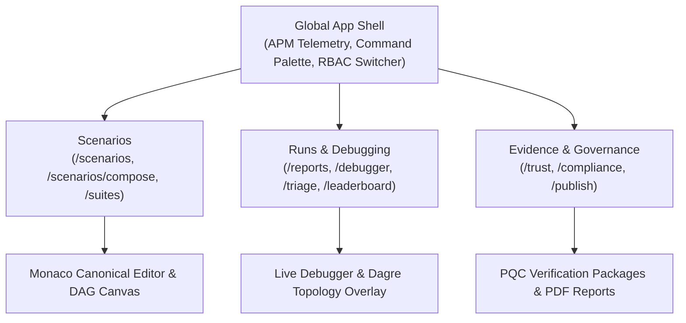
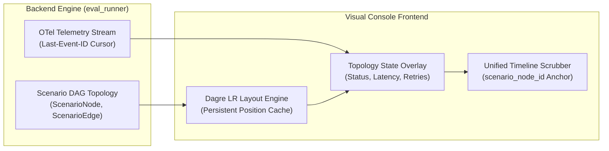
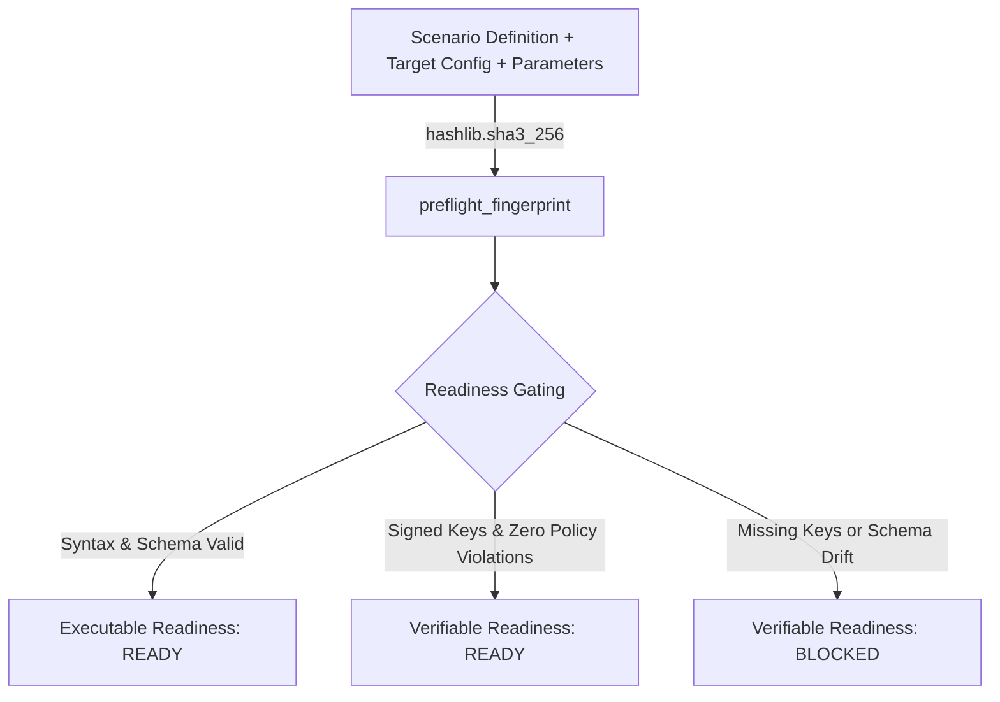
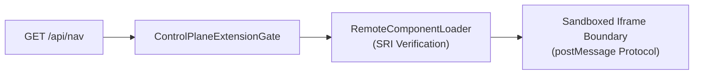

The **Visual Console** (launched via `agentv console` or `eval-runner console`) is the enterprise single-page application (SPA) for managing the complete agent assurance lifecycle:
**Compose → Validate → Run → Verify → Investigate → Issue Evidence**.

```bash
agentv console --host 127.0.0.1 --port 5000
```

---

## 🧭 Information Architecture

The interface organizes all evaluation workflows into distinct operational views:



---

## 1. 🔬 Live Debugger & Canonical Execution Graph

The **Live Debugger** (`/debugger`) provides real-time, deterministic inspection of agent reasoning, state transitions, tool invocations, and virtual filesystem mutations.



### Key Architectural Pillars:

1. **Scenario-Primary Execution Topology**:
   - The structural graph topology is derived directly from the canonical Scenario DAG (`scenario_node_id`, `from_scenario_node_id`, `to_scenario_node_id`).
   - OpenTelemetry runtime events dynamically overlay real-time status badges (`success`, `failed`, `running`, `retrying`), latency measurements, and attempt counts without perturbing the underlying graph structure.

2. **Canonical Identity Triple**:
   - `scenario_node_id`: Stable scenario node identifier acting as the primary join key across backend engine, frontend graph, and timeline.
   - `execution_instance_id`: Per-attempt unique instance key formatted as `{scenario_node_id}:attempt:{n}`.
   - `parent_execution_id`: Explicit lineage identifier tracking retry and branching relationships.

3. **Layout Stability & Persistent Coordinate Cache**:
   - Automatic graph layout is computed using a directed acyclic graph (Dagre `LR` left-to-right) engine.
   - User drag-and-drop manual position adjustments are cached persistently in `nodePositionsRef`, preventing jarring layout jumps or node snaps during high-frequency live SSE event streaming.

4. **Resilient SSE Streaming with `Last-Event-ID` Catch-Up Replay**:
   - Telemetry streams over HTTP Server-Sent Events (`GET /api/v1/runs/<run_id>/stream`).
   - Every event payload includes a monotonically increasing `id`. If a network interruption occurs, the client automatically reconnects with the `Last-Event-ID` header, causing the backend to replay buffered historical events seamlessly without duplicate state emissions or missing frames.

5. **Bidirectional Timeline Synchronization**:
   - The bottom timeline scrubber displays chronological event slices. Clicking any step in the timeline automatically centers and highlights the corresponding node in the visual graph via its `scenario_node_id`.

6. **Edge Visual Hierarchy & Disambiguation**:
   - In `executed` and `divergence` modes, planned/unexecuted edges are visually subordinated with muted dashed lines (`stroke-dasharray: 4,4`), preventing visual clutter.
   - Executed edges are accentuated as solid paths dynamically color-coded by the downstream node's execution outcome (`#10b981` success, `#f43f5e` failure/deviation).
   - An interactive **Edge Hierarchy Legend** in the debugger toolbar provides immediate visual clarity across planned, executed, and divergent pathways.

---

## 2. 🎨 Visual Composer & Monaco Source of Truth

The **Scenario Composer** (`/scenarios/compose` or `/editor`) offers dual-mode scenario authoring, uniting visual graph-based workflow design with industrial code editing.

### Features:

- **Monaco Canonical Source of Truth**:
  - The embedded Monaco JSON/YAML editor acts as the authoritative document state.
  - Edits in the visual canvas instantly reflect in the code editor, and syntax changes in Monaco immediately re-render the visual graph via bi-directional AST synchronization.
- **Scenario Lifecycle State Machine**:
  - Governs scenario lifecycle across formal enterprise stages:
    $$\text{Draft} \longrightarrow \text{InReview} \longrightarrow \text{Ready} \longrightarrow \text{Published} \longrightarrow \text{Deprecated}$$
  - **Mandatory Audit Reason Gate**: Transitioning from `Ready` to `Published` requires entering an explicit audit justification reason in an interactive dialog, recorded into the audit ledger for governance compliance.
- **Typed Scenario Assertions**:
  - Author structured verification criteria directly within the editor:
    - `exact`: Deterministic literal string or value matching.
    - `regex`: Regular expression pattern validation on agent outputs.
    - `numerical_tolerance`: Threshold validation with absolute and relative delta bounds.
    - `json_schema`: Full JSON Schema validation against structured payloads.
- **Conditional Edge Editing**:
  - Configure branching conditions and decision predicates connecting workflow steps.
- **Optimistic Concurrency Control**:
  - Scenario saves enforce document revision hashing (`expected_revision_hash`), preventing accidental overwrites in multi-user environments.
- **Dark Mode Canvas & Node Dragging**:
  - Smooth pan/zoom canvas, customized node connectors, and validation error markers.

---

## 3. ⚡ Evaluation Runner & Preflight Assurance

The **Evaluation Runner** (`/runs/new` or home screen) manages test execution against frontier models and custom agent endpoints.

### Preflight Fingerprinting & Dual-Tier Readiness:



1. **Deterministic Fingerprinting**:
   - A cryptographic digest (`preflight_fingerprint`) is computed using `hashlib.sha3_256` over the canonical scenario definition, target URL, and execution parameter matrix.
   - Any modification to input fields automatically invalidates stale preflight checks, triggering immediate background re-validation.

2. **Dual-Tier Readiness Gates**:
   - **Executable Gate**: Confirms that the target endpoint is reachable, required world shims are available, and the scenario workflow is structurally complete.
   - **Verifiable Gate**: Confirms that cryptographic signing keys are active (`IdentityService`), policy references are satisfied, and zero security warnings exist.

3. **Frontier Model Targets (2026 Baselines)**:
   - Built-in connection profiles for **Gemini 3.7 Flash**, **Claude Opus 5 / Claude 3.7 Sonnet**, **OpenAI GPT-5.6**, and local **Ollama** fleets (`deepseek-r1:70b`, `llama-3.3`).

---

## 4. 🗂️ Scenario Library & Catalog Navigation

The **Scenario Library** (`/scenarios`) enables exploration across thousands of pre-built industrial benchmarks:

- **Taxonomy & Sector Filtering**: Filter by industry domain (Finance, Healthcare, Defense, Smart Cities, etc.), NIST AI 100-1 trustworthiness dimensions, and difficulty level (L1 Basic to L5 Complex Interactive).
- **Readiness Probes**: Instant visibility into whether scenarios are fully runnable or require specific environment secrets.
- **Full-Text Search**: Instant search matching across title, tags, intent descriptions, and tool requirements.

---

## 5. 📑 Runs, Truthful PDF Reports & Metrics Leaderboard

### Runs & Reports (`/reports`):
- Filter by status (`passed`, `failed`, `running`, `unverified`, `error`).
- Detailed execution drawers displaying duration, token consumption, and assertion breakdowns.
- **Truthful Enterprise PDF Generation**:
  - The PDF generation engine (`eval_runner/console/pdf_service.py` via ReportLab) extracts all execution metrics, timestamps, and pass/fail states directly from authentic `summary.json` and `run_manifest.json` artifacts.
  - Zero manufactured or hardcoded placeholder strings; unverified runs explicitly reflect `UNVERIFIED` badges.

### Metrics Leaderboard (`/leaderboard`):
- Comparative evaluation rankings across different agent models and prompt versions.
- Inclusive ranking with certification badges (`CERTIFIED` vs `UNVERIFIED`).
- Pass-rate filtering, threshold controls, and JSON export.

---

## 6. 🛡️ Trust Center & Evidence Verification

The **Trust Center** (`/trust`) provides cryptographic transparency for non-repudiable audit logs:

- **Server-Authoritative Verification**:
  - The UI verifies runs by querying `/api/v1/runs/<run_id>/verify`, which triggers `TraceVerifier.verify_run_directory()`.
  - Mathematical proof verification of trace hash (`sha3_256`), evidence ledger files, seal hash anchor, and Ed25519 / Post-Quantum (PQC) signatures.
- **Downloadable Verification Packages (`.agentv-package.json`)**:
  - Download self-contained, tamper-proof packages conforming to NIST SP 800-218 and EU AI Act specifications.

---

## 7. 🔌 Micro-Frontend Extension Architecture & Zero-Trust Isolation

The Visual Console decouples open-core OSS functionality from enterprise control plane extensions via a dynamic, sandboxed architecture:



- **Dynamic Module Discovery**: Navigation routes and enterprise tools are discovered dynamically via `GET /api/nav`.
- **Subresource Integrity (SRI) Enforcement**:
  - Remote modules must declare valid SRI digests.
  - Supported algorithms: FIPS 202 SHA-3 (`sha3-256-`, `sha3-384-`, `sha3-512-`) and standard W3C fallback (`sha384-`, `sha256-`).
- **Sandboxed Execution**: Remote extension bundles render inside zero-trust isolated iframes communicating via structured `postMessage` envelopes.
- **Dynamic RBAC Context Switcher**:
  - Built-in development role simulator allowing instant switching between `Viewer`, `Operator`, `Auditor`, and `Admin` permissions to validate UI authorization boundaries.
- **Zero-Config Bootstrap Authentication**:
  - On fresh local runs where no `DASHBOARD_API_KEY` or `SERVICE_API_KEY` is configured, an admin key is auto-generated into `.aes/keys/bootstrap.key` and displayed in the terminal banner.
- **Non-Blocking Viewer Experience**:
  - Unauthenticated users automatically enter in read-only `Viewer` mode, browsing benchmarks and past runs freely without blocking modal dialogs. Writing or promoting runs triggers the authenticated `LoginModal` with first-run key guidance.
