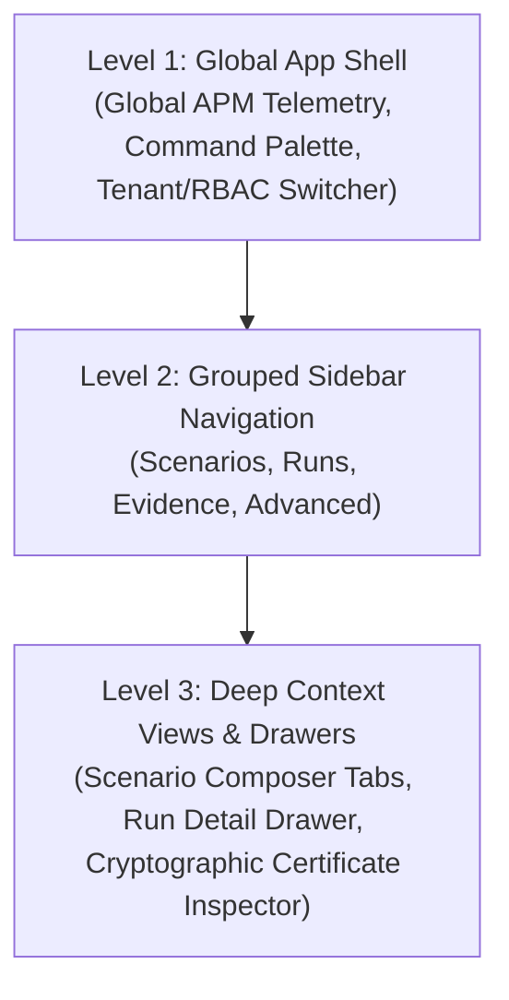
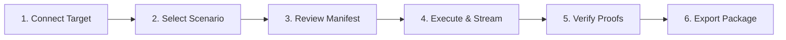

The **Visual Console** (launched via `agentv console` or `eval-runner console`) is the enterprise single-page application (SPA) for managing the complete agent assurance lifecycle:
**Compose → Validate → Run → Verify → Investigate → Issue Evidence**.

---

## 🧭 3-Pillar Information Architecture

The interface organizes all evaluation activities into three first-class objects:

1. **Scenarios**:
   - **Scenario Library** (`/scenarios`): Searchable catalog across 5,000+ industry scenarios with readiness probes and tag filtering.
   - **Visual Composer** (`/editor` or `/scenarios/compose`): Author full assurance contracts visually (intent, preconditions, required tools, topology graph, invariants, success criteria, and lossless raw JSON).
   - **Suites & Benchmarks** (`/suites`): Manage regression bundles and domain benchmark sets.

2. **Runs**:
   - **Active & History** (`/reports` or `/runs`): Master execution stream, two-tier status tracking, and comparative execution metrics.
   - **Live Debugger** (`/debugger`): Real-time OpenTelemetry trace streaming, VFS sandbox inspection, and frame-by-frame trajectory playback.
   - **Triage Center** (`/triage`): Automated root-cause isolation and failure classification.

3. **Evidence**:
   - **Verification Packages** (`/api/v1/evidence/packages/<run_id>`): Single-file, self-contained `.agentv-package.json` bundles containing the full scenario, resolved manifest, telemetry digests, assertion outcomes, and cryptographic signatures.
   - **Trust Center** (`/trust`): Post-quantum cryptographic (PQC) certificate inspection and public key verification.
   - **Compliance Forensics** (`/compliance`): NIST SP 800-218 and EU AI Act compliance evidence.
   - **Publication Suite** (`/publish`): Multi-agent report generation and verifiable credentials.

---

## ⚡ Primary Verification Journey

The home screen provides a guided 6-stage workflow:

1. **Target Connection Profile**: Select from pre-configured 2026 frontier models or connect internal agent services:
   - **OpenAI**: `gpt-5.6` (Production endpoint)
   - **Anthropic**: `claude-opus-5` (Anthropic protocol)
   - **Google GenAI**: `gemini-3.1-pro-preview` (Gemini API)
   - **Local Fleet**: `deepseek-r1:70b` / `llama-3.3` (Ollama localhost)
   - **Custom Enterprise Agent**: Internal agent orchestrators exposing REST / Agent Protocol endpoints.
2. **Scenario Selection**: Pick single scenarios or multi-scenario regression suites.
3. **Resolved Manifest Review**: Inspect the read-only preflight matrix (exact scenario hash `sha3_256:...`, target parameters, limits, timeouts, and active evaluators).
4. **Execution & Live Telemetry**: Execute in an isolated sandbox with live SSE event streaming.
5. **Evidence-Linked Verification**: Inspect mathematical assertion verdicts, state comparisons, and tool audit trails.
6. **Export Evidence**: Download the immutable `.agentv-package.json` package or executive PDF report.

---

## 🔬 Canonical Run Detail Screen

Selecting any run opens the **7-Tab Forensic Inspection Screen**:

| Tab | Purpose |
| :--- | :--- |
| **Summary** | Answers *"Did this agent safely achieve the intended state transition?"* with primary verdict card, execution duration, tokens, and assurance scores. |
| **Verification & Proofs** | Exact mathematical assertion outcomes, judge consensus verdicts, and Ed25519 cryptographic sealer signatures. |
| **State & Tool Evidence** | Ground-truth records of all physical tool calls, API parameters, and database mutations. |
| **Telemetry Trace** | Chronological OpenTelemetry-aligned event stream with step-by-step payloads. |
| **VFS Sandbox** | Virtual filesystem delta logs and container isolation teardown records. |
| **Policy & Guardrails** | Active guardrail intercepts, safety boundary checks, and human-in-the-loop (HITL) approvals. |
| **Artifacts & Package** | Downloadable `.agentv-package.json` Verification Package and PDF compliance summary. |

---

## 🛡️ Enterprise Security Boundaries

- **Default-Deny RBAC**: Session context initializes strictly to `Viewer` with fail-closed `<ProtectedRoute />` route guards. Persona simulation is restricted strictly to local dev mode.
- **Signed Extension Manifests**: Remote micro-frontend extensions loaded via `GET /api/nav` must provide a signed manifest schema and mandatory Subresource Integrity digest (`SHA-384`/`SHA-512`) verified via WebCrypto before execution.
- **Single-File Verification Packages**: Conforms to NIST 2026 AI evaluation auditability standards with deterministic SHA3-256 package hashing.

