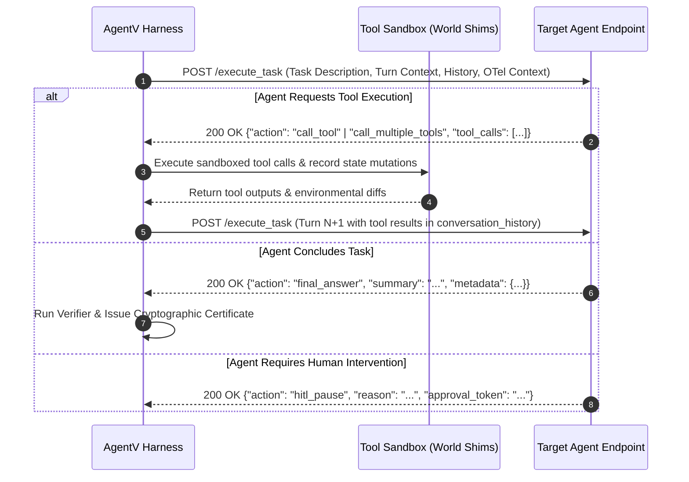

The **Agent Interaction Contract** defines the bidirectional communication interface between the AgentV evaluation runtime and the AI agent under evaluation.



---

## 📡 1. HTTP/REST Protocol Specification

By default, the harness connects to an agent exposing a standard HTTP endpoint:

```http
POST /execute_task HTTP/1.1
Host: agent-service.internal:8000
Content-Type: application/json
traceparent: 00-4bf92f3577b34da6a3ce929d0e0e4736-00f067aa0ba902b7-01
tracestate: agentv=session_123
```

### Request Payload Schema

```json
{
  "run_id": "run_fintech_2026_01",
  "task_description": "Verify applicant KYC documents, calculate debt-to-income ratio, and approve or decline loan.",
  "turn": 1,
  "max_turns": 10,
  "scenario_id": "loan_approval_risk_check",
  "conversation_history": [
    {
      "role": "user",
      "content": "Verify applicant KYC documents, calculate debt-to-income ratio, and approve or decline loan."
    }
  ],
  "available_tools": [
    {
      "name": "fetch_applicant_kyc",
      "description": "Retrieves verified identity and tax records for an applicant ID.",
      "parameters": {
        "type": "object",
        "properties": {
          "applicant_id": { "type": "string" }
        },
        "required": ["applicant_id"]
      }
    },
    {
      "name": "submit_underwriting_decision",
      "description": "Submits final underwriting decision to core ledger.",
      "parameters": {
        "type": "object",
        "properties": {
          "applicant_id": { "type": "string" },
          "decision": { "type": "string", "enum": ["APPROVED", "DECLINED", "MANUAL_REVIEW"] },
          "dti_ratio": { "type": "number" }
        },
        "required": ["applicant_id", "decision", "dti_ratio"]
      }
    }
  ],
  "span_context": {
    "trace_id": "4bf92f3577b34da6a3ce929d0e0e4736",
    "span_id": "00f067aa0ba902b7",
    "trace_flags": 1
  }
}
```

---

## 🛠️ 2. Agent Action Response Envelope

The agent must return an **Action Envelope** object. Four standard actions are supported:

### 1. `call_tool` (Single Tool Invocation)
```json
{
  "action": "call_tool",
  "tool_name": "fetch_applicant_kyc",
  "tool_args": {
    "applicant_id": "APP-98214"
  },
  "summary": "Fetching KYC verification documents for applicant APP-98214."
}
```

### 2. `call_multiple_tools` (Parallel Parameterized Tool Calls)
```json
{
  "action": "call_multiple_tools",
  "tool_calls": [
    {
      "tool": "fetch_applicant_kyc",
      "params": { "applicant_id": "APP-98214" }
    },
    {
      "tool": "check_credit_score",
      "params": { "ssn_last4": "8841" }
    }
  ],
  "summary": "Fetching KYC records and credit bureau score in parallel."
}
```

### 3. `final_answer` (Session Completion)
```json
{
  "action": "final_answer",
  "summary": "Underwriting completed. Applicant credit score is 745 and DTI is 28.5%. Loan decision APPROVED under policy FIN-POL-402.",
  "metadata": {
    "decision": "APPROVED",
    "dti": 0.285,
    "confidence": 0.98
  }
}
```

### 4. `hitl_pause` (Human-in-the-Loop Intervention)
```json
{
  "action": "hitl_pause",
  "reason": "Loan amount exceeds $500,000 automated threshold; requesting manual credit officer sign-off.",
  "approval_token": "req_hitl_882910"
}
```

---

## 🔁 3. Receiving Tool Results in Subsequent Turns

When the agent requests tool execution, the **AgentV harness executes the sandboxed tools** and appends the outputs to `conversation_history` on turn $N+1$:

```json
{
  "run_id": "run_fintech_2026_01",
  "task_description": "Continue loan assessment.",
  "turn": 2,
  "conversation_history": [
    {
      "role": "user",
      "content": "Verify applicant KYC documents, calculate debt-to-income ratio, and approve or decline loan."
    },
    {
      "role": "assistant",
      "action": "call_tool",
      "tool_name": "fetch_applicant_kyc",
      "tool_args": { "applicant_id": "APP-98214" }
    },
    {
      "role": "tool",
      "name": "fetch_applicant_kyc",
      "content": "{\"status\": \"VERIFIED\", \"monthly_income\": 12500, \"monthly_debt\": 3500}"
    }
  ]
}
```

:::note[Important: Authoritative Execution]
The agent **must never fabricate tool outputs** or claim to execute tools locally. The harness is the sole authoritative gateway to simulated environments and world shims.
:::

---

## 🧬 4. OpenTelemetry Context & Behavioral DNA

The harness automatically injects W3C Distributed Tracing headers (`traceparent`, `tracestate`) and span metadata into every turn invocation.

### Recommended Telemetry Markers:
Agents can include structured operational telemetry in `metadata.telemetry`:

```json
{
  "action": "call_tool",
  "tool_name": "submit_underwriting_decision",
  "tool_args": {
    "applicant_id": "APP-98214",
    "decision": "APPROVED",
    "dti_ratio": 0.28
  },
  "metadata": {
    "telemetry": {
      "phase": "Decision Execution",
      "subtask": "Underwriting Ledger Commit",
      "action": "POST /v1/underwriting/commits",
      "reasoning_step": 4,
      "token_usage": {
        "prompt_tokens": 1420,
        "completion_tokens": 85
      }
    }
  }
}
```

---

## 🔌 5. Non-HTTP Protocol Alternatives

### Local Subprocess (`local://`)
The harness executes the agent command as a local child process communicating over standard input/output streams:
- `stdin`: Single-line JSON request envelope per turn.
- `stdout`: Single-line JSON action response envelope.
- `stderr`: Streamed to engine debug logs.

```bash
agentv run --scenario scenarios/loan.json --protocol local --agent "python -m my_agent.cli"
```

### Persistent TCP/Unix Socket (`socket://`)
The harness connects via persistent TCP socket, transmitting newline-delimited JSON packets. This mode eliminates HTTP connection setup latency for high-throughput batch benchmarks.

```bash
agentv evaluate --path scenarios/ --protocol socket --agent "socket://127.0.0.1:9099"
```
