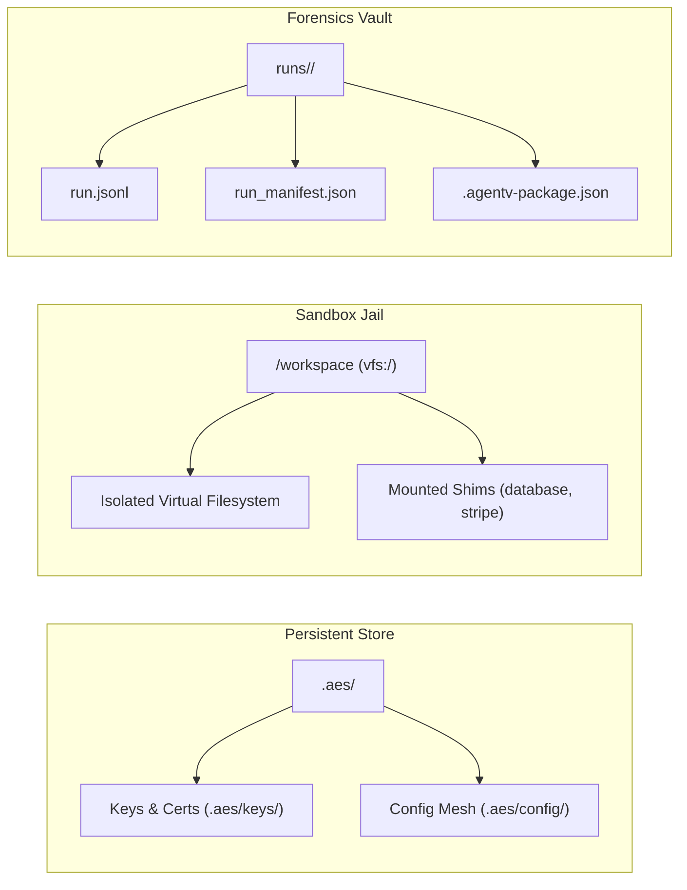

The **Agent Evaluation Specification (AES v1.4)** is the authoritative, framework-agnostic schema contract defining evaluation scenarios in AgentV. It standardizes task definitions, workflow directed acyclic graphs (DAGs), multi-turn agent interactions, typed assertion oracles, and environment simulator sandboxes.

---

## 1. Schema Architecture & Validation Constraints

Every AES v1.4 scenario is defined as a JSON or YAML document adhering strictly to [`spec/aes/aes.schema.json`](/spec/aes/aes.schema.json).

### Strict Schema Rules:
- **`additionalProperties: false`**: Root-level properties outside the formal specification are strictly prohibited and fail schema validation.
- **Deterministic Canonical Serialization**: When hashed or signed, scenarios are normalized via pure RFC 8785 JSON Canonicalization Scheme (JCS) (`agentv_runtime.canonical`).
- **Semantic Version Pinning**: The `aes_version` field must equal `1.4`.

```json
{
  "aes_version": 1.4,
  "metadata": {
    "id": "fintech-loan-approval-001",
    "name": "Commercial Loan Approval & Risk Assessment",
    "industry": "Finance",
    "use_case": "Underwriting",
    "capabilities": ["financial_analysis", "credit_pull", "compliance_reporting"],
    "standards_registry": ["ISO_20022", "NIST_AI_100_1"]
  },
  "workflow": {
    "nodes": [
      {
        "id": "step_1_credit_pull",
        "task_description": "Retrieve credit bureau report for applicant ID #98231.",
        "success_criteria": [
          {"metric": "tool_call_correctness", "threshold": 1.0},
          {"metric": "exact_match", "expected": "BUREAU_SUCCESS", "threshold": 1.0}
        ]
      }
    ],
    "edges": []
  },
  "evaluation": {
    "panel": [
      {"judge": "luna_judge", "weight": 0.6},
      {"judge": "oracle_exact", "weight": 0.4}
    ],
    "consensus_threshold": 0.85
  }
}
```

---

## 2. Root Property Specification

| Property | Type | Requirement | Description |
| :--- | :--- | :--- | :--- |
| **`aes_version`** | `number` | **Required** | The specification version. Must be `1.4`. |
| **`metadata`** | `object` | **Required** | Metadata, taxonomy coordinates, regulatory standards, and compliance tags. |
| **`workflow`** | `object` | **Required** | The Workflow DAG specifying tasks, transitions, dependencies, and assertions. |
| **`evaluation`** | `object` | **Required** | Evaluation parameters, consensus panels, scoring weights, and oracle thresholds. |
| **`tools`** | `object` | *Optional* | Permitted tools, expected parameter schemas, and mock responses. |
| **`initial_state`** | `object` | *Optional* | Genesis world state seeded into the Virtual File System (VFS) or shims. |
| **`environmental_snapshot`** | `object` | *Optional* | Pinned infrastructure registry snapshot and dependency digests. |
| **`enabled_shims`** | `array` | *Optional* | Explicit whitelist of world simulators to activate (e.g., `["database", "stripe", "jira"]`). |
| **`failure_policy`** | `string` | *Optional* | DAG execution policy: `fail_fast`, `continue_independent`, `compensate_then_fail`, `best_effort`. |
| **`cleanup_workspace`** | `boolean` | *Optional* | `true` (default) purges workspace on teardown; `false` preserves disk state for forensic review. |
| **`description`** | `string` | *Optional* | Human-readable synopsis for scenario catalogs and visual leaderboards. |
| **`industry`** | `string` | *Optional* | Vertical industry classification (e.g., `Finance`, `Healthcare`, `Energy`). |
| **`use_case`** | `string` | *Optional* | Specific business domain task (e.g., `Fraud Detection`, `Claims Adjudication`). |

---

## 3. Metadata Specification (`metadata`)

The `metadata` block provides immutable identity and regulatory governance mapping:

- **`id`** *(string, required)*: Unique slug identifier matching `^[a-z0-9\-_]+$`.
- **`name`** *(string, optional)*: Human-readable scenario title.
- **`capabilities`** *(list[string], required)*: Minimum agent capabilities required to execute the scenario (e.g. `sql_query`, `api_rest`, `pdf_analysis`).
- **`standards_registry`** *(list[string], optional)*: Aligned regulatory frameworks (`NIST_AI_100_1`, `EU_AI_ACT_ART_15`, `ISO_20022`, `HIPAA`, `GDPR`).
- **`compliance_level`** *(string, optional)*: Tier classification: `Standard`, `High_Assurance`, `Mission_Critical`.
- **`author`** *(string, optional)*: Benchmark author identity or organization.

---

## 4. Workflow DAG Specification (`workflow`)

AES v1.4 replaces linear tasks with an expressive Directed Acyclic Graph (DAG):

### Nodes (`workflow.nodes`)
Each node represents an atomic step in the agent evaluation lifecycle:
- **`id`** *(string, required)*: Unique node identifier within the scenario DAG.
- **`task_description`** *(string, required)*: Natural language instruction presented to the agent.
- **`timeout_seconds`** *(int, optional)*: Per-task wall-clock execution limit (default: global timeout).
- **`max_attempts`** *(int, optional)*: Maximum retry turns allowed before declaring a logic stall.
- **`success_criteria`** *(list[object], required)*: Typed assertions that must be satisfied to traverse the node.

### Typed Assertions (`success_criteria`)
AgentV provides four native assertion operators:
1. **`exact`**: Strict byte-for-byte or normalized string equality.
2. **`regex`**: Regular expression pattern matching over agent output or tool parameters.
3. **`numerical_tolerance`**: Float comparisons within an absolute tolerance ($\pm \epsilon$).
4. **`json_schema`**: Validates agent structured output against a target Draft-07 JSON Schema.

```json
{
  "metric": "tool_call_parameter",
  "assertion_type": "exact",
  "tool_name": "execute_transfer",
  "parameter": "amount",
  "expected": 50000.0,
  "threshold": 1.0
}
```

### Edges (`workflow.edges`)
Declare topological transitions and conditional branching:
- **`from`** *(string, required)*: Source node ID.
- **`to`** *(string, required)*: Destination node ID.
- **`condition`** *(string, optional)*: Evaluated Python expression (e.g., `step_1.status == 'success'`).

---

## 5. Storage Boundaries & Sandbox Plumbing

AES scenarios operate across four strictly isolated storage domains:



1. **Persistent Key Store (`.aes/`)**: Holds bootstrap keys (`.aes/keys/bootstrap.key`), signing certificates, and local trust root anchors. Never modified by agent executions.
2. **Sandbox Jail (`/workspace` / `vfs:/`)**: Ephemeral, state-aware container created per run. Tools execute within this jail, with automated rollback and isolation.
3. **Forensics Vault (`runs/<run_id>/`)**: Authoritative, append-only records containing `run.jsonl`, execution manifests, and signed Verification Certificates.

---

## 6. CLI Validation & Quality Linting

Validate any AES scenario before deployment:

```bash
# Formal JSON Schema compliance check
agentv aes validate --path industries/finance/scenarios/loan_approval.json

# Industrial quality linter (score >= 90 required for production)
agentv lint --path industries/finance/scenarios/loan_approval.json
```
