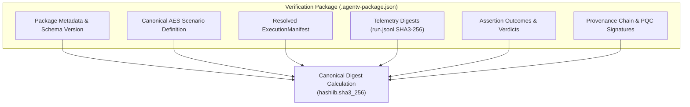

The **AgentV Verification Package** (`.agentv-package.json`) is an immutable, self-contained single-file audit artifact that bundles all forensic evidence from an agent evaluation run.



---

## 1. Schema Structure (`agentv-package.schema.json`)

```json
{
  "$schema": "http://json-schema.org/draft-07/schema#",
  "title": "AgentV Verification Package",
  "type": "object",
  "required": [
    "package_version",
    "package_digest",
    "run_id",
    "scenario",
    "manifest",
    "telemetry_digest",
    "assertion_outcomes",
    "signatures"
  ],
  "properties": {
    "package_version": { "type": "string", "enum": ["1.0.0", "2.0.0"] },
    "package_digest": { "type": "string", "pattern": "^sha3_256:[a-f0-9]{64}$" },
    "run_id": { "type": "string" },
    "scenario": { "type": "object" },
    "manifest": { "type": "object" },
    "telemetry_digest": {
      "type": "object",
      "required": ["trace_hash", "total_events", "seal_hash"],
      "properties": {
        "trace_hash": { "type": "string" },
        "total_events": { "type": "integer" },
        "seal_hash": { "type": "string" }
      }
    },
    "assertion_outcomes": {
      "type": "array",
      "items": {
        "type": "object",
        "required": ["criterion_type", "passed", "score"],
        "properties": {
          "criterion_type": { "type": "string" },
          "passed": { "type": "boolean" },
          "score": { "type": "number" },
          "details": { "type": "object" }
        }
      }
    },
    "evidence_ledger": {
      "type": "object",
      "additionalProperties": { "type": "string" }
    },
    "signatures": {
      "type": "array",
      "items": {
        "type": "object",
        "required": ["identity", "algorithm", "signature"],
        "properties": {
          "identity": { "type": "string" },
          "algorithm": { "type": "string", "enum": ["Ed25519", "ML-DSA-65", "ML-DSA-87", "hybrid-pqc"] },
          "signature": { "type": "string" },
          "timestamp": { "type": "string" }
        }
      }
    }
  }
}
```

---

## 2. Deterministic Digest Calculation

To guarantee 100% digest reproducibility across export operations:
1. The scenario, manifest, telemetry digests, assertion verdicts, and evidence ledger are serialized into canonical sorted JSON.
2. The package digest is computed:
   $$\text{package\_digest} = \text{sha3\_256:}\text{SHA3-256}\left(\text{CanonicalJSON}\left(\text{Payload}\right)\right)$$
3. The resulting digest is embedded into `package_digest`. Re-verifying the file independently recalculates the digest over the canonicalized payload excluding the `package_digest` key.
