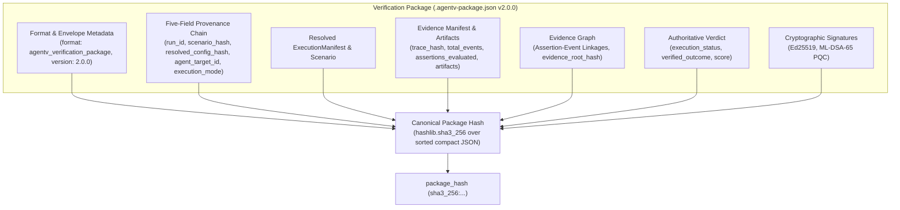

The **AgentV Verification Package** (`.agentv-package.json`) is an immutable, self-contained single-file audit artifact that bundles all forensic evidence, execution provenance, and cryptographic proofs from an agent evaluation run.



---

## 1. Authoritative Schema Structure (`agentv-package.schema.json` v2.0.0)

The package adheres strictly to the `agentv-package.schema.json` specification:

```json
{
  "$schema": "http://json-schema.org/draft-07/schema#",
  "$id": "https://agentv.dev/spec/agentv-package/agentv-package.schema.json",
  "title": "AgentV Verification Package (.agentv-package.json) v2.0.0",
  "type": "object",
  "required": [
    "format",
    "package_version",
    "run_id",
    "chain",
    "verdict",
    "evidence_chain_valid",
    "cryptographic_verification",
    "evidence_manifest",
    "evidence_graph",
    "package_hash"
  ],
  "properties": {
    "format": {
      "type": "string",
      "const": "agentv_verification_package"
    },
    "package_version": {
      "type": "string",
      "const": "2.0.0"
    },
    "run_id": {
      "type": "string",
      "description": "Globally-unique run identifier (UUIDv7-suffixed)."
    },
    "tenant_id": { "type": "string" },
    "workspace_id": { "type": "string" },
    "chain": {
      "type": "object",
      "description": "Five-field provenance chain binding execution parameters.",
      "required": [
        "run_id",
        "scenario_hash",
        "resolved_config_hash",
        "agent_target_id",
        "execution_mode"
      ],
      "properties": {
        "run_id": { "type": "string" },
        "scenario_hash": { "type": ["string", "null"] },
        "resolved_config_hash": { "type": ["string", "null"] },
        "agent_target_id": { "type": ["string", "null"] },
        "execution_mode": {
          "type": "string",
          "enum": ["simulated", "record_replay", "live", "hybrid", "unknown"]
        },
        "execution_mode_declared": { "type": "boolean" }
      }
    },
    "manifest": { "type": "object" },
    "scenario": { "type": "object" },
    "verdict": {
      "type": "object",
      "required": ["execution_status", "verified_outcome", "duration_seconds", "score"],
      "properties": {
        "execution_status": { "type": "string" },
        "verified_outcome": {
          "type": "string",
          "enum": ["VERIFIED", "UNVERIFIED", "NOT_VERIFIED", "POLICY_BREACH", "EVIDENCE_INVALID"]
        },
        "duration_seconds": { "type": "number" },
        "score": { "type": "number", "minimum": 0, "maximum": 1 }
      }
    },
    "evidence_chain_valid": {
      "type": "boolean",
      "description": "true ONLY when verified_outcome == VERIFIED and no corruption detected."
    },
    "cryptographic_verification": {
      "type": "object",
      "properties": {
        "verified": { "type": "boolean" },
        "signer_identity": { "type": ["string", "null"] },
        "manifest_hash_match": { "type": "boolean" },
        "scenario_hash_match": { "type": "boolean" },
        "algorithm": { "type": ["string", "null"] },
        "errors": { "type": "array", "items": { "type": "string" } }
      }
    },
    "evidence_manifest": {
      "type": "object",
      "required": ["trace_hash", "total_events", "assertions_evaluated", "artifacts"],
      "properties": {
        "trace_hash": { "type": "string", "pattern": "^sha3_256:[a-fA-F0-9]{64}$" },
        "total_events": { "type": "integer", "minimum": 0 },
        "assertions_evaluated": { "type": "integer", "minimum": 0 },
        "artifacts": {
          "type": "array",
          "items": {
            "type": "object",
            "required": ["name", "hash", "type"],
            "properties": {
              "name": { "type": "string" },
              "hash": { "type": "string" },
              "type": { "type": "string" }
            }
          }
        }
      }
    },
    "evidence_graph": {
      "type": "object",
      "description": "Assertion-to-source-event linkage graph and evidence_root_hash."
    },
    "integrity_corruption": {
      "type": "object",
      "description": "Present ONLY when corrupted trace lines exist."
    },
    "signatures": { "type": "array" },
    "package_hash": {
      "type": "string",
      "pattern": "^sha3_256:[a-fA-F0-9]{64}$"
    },
    "package_created_at": {
      "type": "string",
      "format": "date-time"
    }
  }
}
```

---

## 2. Deterministic Package Hash Calculation

To guarantee 100% cryptographic reproducibility across systems and storage media:

1. **Payload Isolation**: The canonical payload dictionary is formed by extracting all package fields **excluding** `package_hash` and `package_created_at`.
2. **Canonical Serialization**:
   ```python
   payload_bytes = json.dumps(
       payload_dict,
       sort_keys=True,
       separators=(",", ":"),
       ensure_ascii=True,
   ).encode("utf-8")
   ```
3. **Digest Generation**:
   $$\text{package\_hash} = \text{"sha3\_256:"} + \text{SHA3-256}(\text{payload\_bytes})\text{.hexdigest()}$$
4. Independent verification re-computes this digest and strictly rejects any package where the recalculated digest deviates from the embedded `package_hash`.
