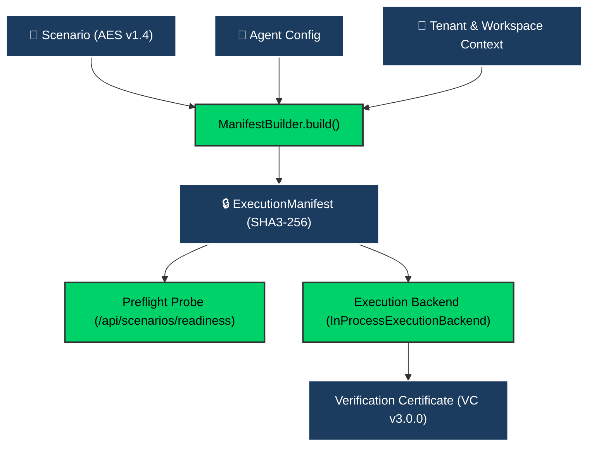

# 1. Overview

The **ExecutionManifest** (`agentv_runtime.manifest.ExecutionManifest`) is the single source of truth contract for evaluation runs in AgentV v2.0.0. It binds scenario definitions, agent connectivity configuration, runtime parameters, tenant boundaries, and environment variables into an immutable, frozen data structure hashed with deterministic SHA3-256.



---

# 2. ExecutionManifest Contract Schema

The manifest is defined in [`agentv_runtime.manifest`](agentv_runtime/manifest.py) as an immutable dataclass (`@dataclass(frozen=True)`).

```python
@dataclass(frozen=True)
class ExecutionManifest:
    manifest_id: str  # Format: "man_{scenario_id}_{sha3_256[:12]}"
    scenario_id: str  # Unique scenario identifier
    scenario_version: str  # Scenario semantic version (e.g., "1.0.0")
    scenario_hash: str  # SHA3-256 hash of canonical scenario JSON payload
    tenant_id: str = "default"  # Multi-tenant isolation boundary
    workspace_id: str = "default"  # Workspace partition within tenant
    agent_config: dict[str, Any]  # Target endpoint, model, protocol, headers
    runtime_config: dict[str, Any]  # Max turns, timeouts, sandbox flags
    environment: dict[str, Any]  # Sealed environmental snapshot
    created_at: str  # ISO 8601 UTC timestamp
    created_by: str = "system"  # Authenticated principal ID
    metadata: dict[str, Any]  # Arbitrary tags and execution context
```

### Deterministic Integrity Hashing
The manifest calculates its cryptographic fingerprint via canonical, sorted JSON serialization:

$$\text{Manifest Hash} = \text{SHA3-256}\left(\text{CanonicalJSON}\left(\text{ManifestPayload}\right)\right)$$

---

# 3. Server-Authoritative Scenario Lifecycle

Scenario documents transition through an authoritative 4-state lifecycle state machine enforced by `POST /api/scenarios/<scenario_id>/transition`:

```
 ┌─────────┐    validate()     ┌───────────┐    approve()     ┌─────────┐
 │  Draft  │ ───────────────>  │ Validated │ ───────────────> │  Ready  │
 └─────────┘                   └───────────┘                  └─────────┘
      │                              │                             │
      └──────────────────────────────┴─────────────────────────────┴─────> ┌────────────┐
                                 deprecate()                               │ Deprecated │
                                                                           └────────────┘
```

### Lifecycle Rules:
1. **`Draft`**: Editable working state. Default for newly created or modified scenarios.
2. **`Validated`**: Passed formal AES schema structure verification (`validate_scenario_structure()`). Cannot contain placeholder nodes or missing required keys.
3. **`Ready`**: Approved for automated test orchestration and benchmark runs.
4. **`Deprecated`**: Read-only archival status. Excluded from active evaluation sweeps.

---

# 4. Fail-Closed Execution Readiness Preflight

Before any evaluation begins, the visual console and CLI query the preflight diagnostic endpoint:

`POST /api/scenarios/readiness`

### Evaluation Probes:
* **Scenario Validation**: Asserts AES schema compliance and lifecycle readiness.
* **Agent Connectivity**: Probes target agent webhook (HTTP/REST, gRPC, or in-process) without defaulting to `localhost`.
* **Signing Backend**: Confirms cryptographic signing posture and key availability if audit enforcement is active (`EVAL_REQUIRE_SIGNING=true`).

---

# 5. Two-Tier Status Architecture

AgentV strictly delineates between technical execution state and verified business outcome:

| Layer | Attribute | Possible States | Meaning |
| :--- | :--- | :--- | :--- |
| **Tier 1** | `execution_status` | `QUEUED`, `RUNNING`, `EXECUTION_COMPLETED`, `EXECUTION_FAILED`, `STALLED` | Technical execution lifecycle of the agent runner and sandbox. |
| **Tier 2** | `verification_decision` | `VERIFIED`, `NOT_VERIFIED`, `POLICY_BREACH`, `UNVERIFIED` | Mathematical & cryptographic policy adjudication outcome. |

Reports and console drawers prioritize the **Verification Decision Card** to ensure regulatory compliance and evidence integrity are the primary product outcome.
