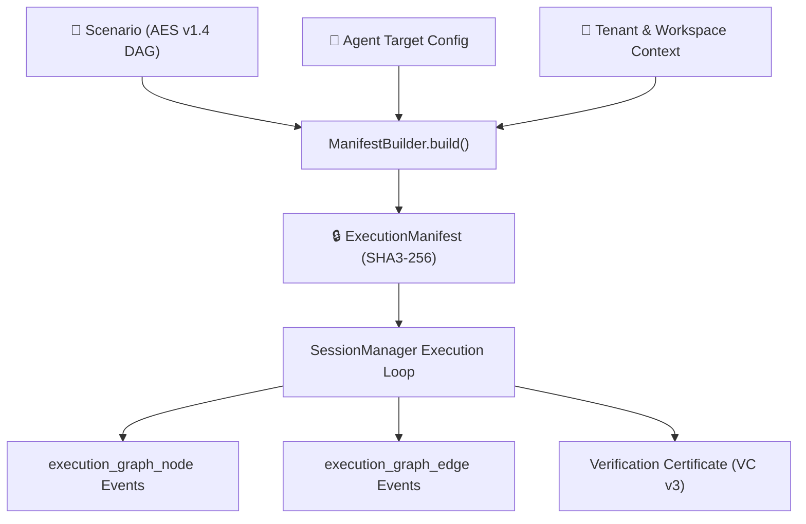

The **ExecutionManifest** (`agentv_runtime.manifest.ExecutionManifest`) and **Canonical Execution Graph** (`runs.schema.json`) define the single source of truth for evaluation runs and observed execution topologies in AgentV.



---

## 1. ExecutionManifest Contract Schema

The manifest is defined in [`agentv_runtime.manifest`](agentv_runtime/manifest.py) as an immutable dataclass (`@dataclass(frozen=True)`):

```python
@dataclass(frozen=True)
class ExecutionManifest:
    manifest_id: str  # Format: "man_{scenario_id}_{sha3_256[:12]}"
    scenario_id: str  # Unique scenario identifier
    scenario_version: str  # Scenario semantic version (e.g., "1.0.0")
    scenario_hash: str  # SHA3-256 hash of canonical scenario JSON payload
    tenant_id: str = "default"  # Multi-tenant isolation boundary
    workspace_id: str = "default"  # Workspace partition within tenant
    agent_config: dict[str, Any]  # Target endpoint, model, protocol, headers
    runtime_config: dict[str, Any]  # Max turns, timeouts, sandbox flags
    environment: dict[str, Any]  # Sealed environmental snapshot
    created_at: str  # ISO 8601 UTC timestamp
    created_by: str = "system"  # Authenticated principal ID
    metadata: dict[str, Any]  # Arbitrary tags and execution context
```

### Deterministic Integrity Hashing
$$\text{Manifest Hash} = \text{SHA3-256}\left(\text{CanonicalJSON}\left(\text{ManifestPayload}\right)\right)$$

---

## 2. Canonical Execution Graph Data Model (`runs.schema.json`)

The execution graph formalizes observed execution topologies, multi-attempt retries, and branching workflows:

### Canonical Identity Model:
- **`scenario_node_id`** *(string, primary key)*: The immutable node ID from the Scenario DAG (e.g., `step_1_credit_pull`).
- **`execution_instance_id`** *(string)*: Per-attempt instance identifier formatted as `{scenario_node_id}:attempt:{attempt_number}`.
- **`parent_execution_id`** *(string, optional)*: Lineage pointer tracking retries or parent subtask dependencies.

### Event Schema 1: `execution_graph_node`
Emitted as each graph step transitions:
```json
{
  "event": "execution_graph_node",
  "scenario_node_id": "step_1_credit_pull",
  "execution_instance_id": "step_1_credit_pull:attempt:1",
  "node_type": "sequential",
  "status": "success",
  "duration_ms": 420.5,
  "attempt": 1,
  "max_attempts": 3,
  "failure_category": null,
  "metadata": {
    "tool_calls_count": 1,
    "tokens_consumed": 280
  },
  "timestamp": "2026-08-26T01:00:00.000Z"
}
```

### Event Schema 2: `execution_graph_edge`
Emitted to declare topological transitions between steps:
```json
{
  "event": "execution_graph_edge",
  "from_scenario_node_id": "step_1_credit_pull",
  "to_scenario_node_id": "step_2_risk_decision",
  "edge_type": "conditional",
  "condition_expression": "step_1_credit_pull.status == 'success'",
  "traversed": true,
  "metadata": {},
  "timestamp": "2026-08-26T01:00:00.500Z"
}
```

---

## 3. Two-Tier Status Architecture

| Layer | Attribute | Possible States | Meaning |
| :--- | :--- | :--- | :--- |
| **Tier 1 (Technical)** | `execution_status` | `QUEUED`, `RUNNING`, `EXECUTION_COMPLETED`, `EXECUTION_FAILED`, `STALLED` | Technical execution lifecycle of the runner and sandbox. |
| **Tier 2 (Governed)** | `verification_decision` | `VERIFIED`, `NOT_VERIFIED`, `POLICY_BREACH`, `UNVERIFIED` | Mathematical & cryptographic policy adjudication outcome. |
